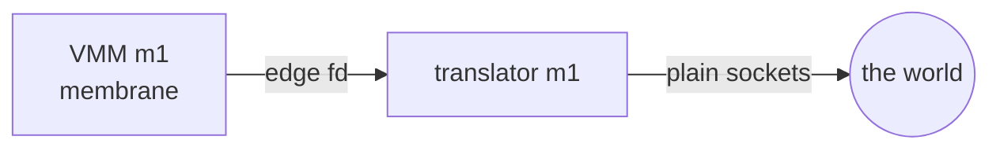
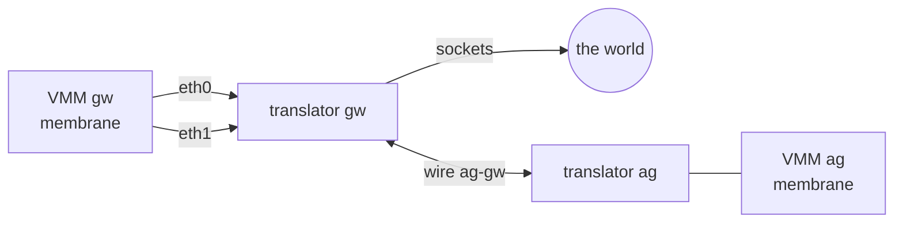
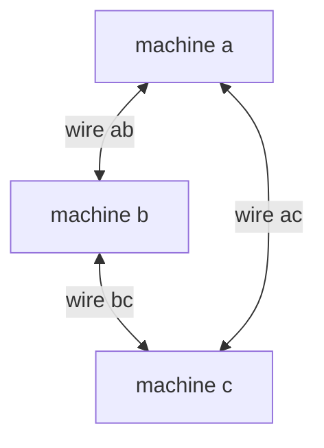
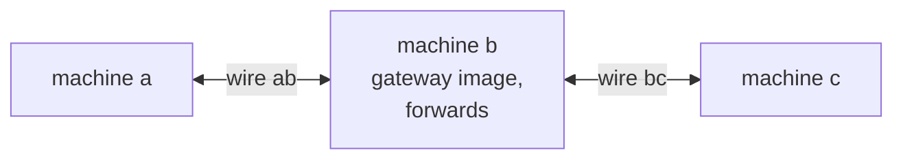

# Examples

Worked shapes, in the smallest number of verbs. Each example is
real: the gates in scripts/test/ exercise the same shapes.

## Networks

A machine's network is one flag at create: `--net SPEC`, where
SPEC is a comma list of nics, in interface order (eth0 first).
The kinds:

- `none` -- airgapped by construction (the default).
- `wire:NAME` -- a wire to the one other machine whose manifest
  names the same wire. Both ends judge every crossing.
- `world` -- the internet, through the machine's own translator:
  sockets, no tap, no capability (see
  docs/ROOTLESS-NETWORK.md).
- `tapN`, `pairNa`, `pairNg`, `auto` -- the pool-tap forms; they
  retire with the rootless network's last rung.

### One machine, the world

```
cella create m1 --net world
cella start m1
cella gateway m1 open
```



The guest is 192.168.210.2 and its gateway is 192.168.210.1; the
translator answers ARP and the gateway's echo at the edge. Every
egress frame parks at the membrane before the translator sees
it; every reply parks in the ingress lane before the guest sees
it.

### Two machines, one wire

```
cella create ag --net wire:ag-gw
cella create gw --net world,wire:ag-gw
```



The wire's name is free (lowercase, digits, dash); pairing IS
the two manifests naming the same string. gw is the appliance:
one nic to the world, one to its agent, both judged at gw's own
membrane.

### Three machines, the triangle

Three wires, each machine holds two nics. No routing guest is
needed; any pair talks directly, and each crossing is judged at
both of its ends.

```
cella create a --net wire:ab,wire:ac
cella create b --net wire:ab,wire:bc
cella create c --net wire:ac,wire:bc
```



The guests address themselves (a wire imposes no convention):
one subnet per wire, set at the console or by the image's init.

### Three machines, the chain

Two wires; the middle machine forwards, so it runs the gateway
image. The cost is the law's, deliberately: a-to-c is four
judged crossings, and the middle machine's book shows everything
it relayed.

```
cella create a --net wire:ab
cella create b --rootfs gateway --net wire:ab,wire:bc
cella create c --net wire:bc
```



### More than three

A wire holds exactly two ends, always. Fan-out is a machine: N
members wanting one broadcast domain meet at a switch guest with
N wire nics (a planned appliance flavor). Fan-out is therefore
always judged and always witnessed -- there is no unjudged hub
anywhere in a cella topology.
