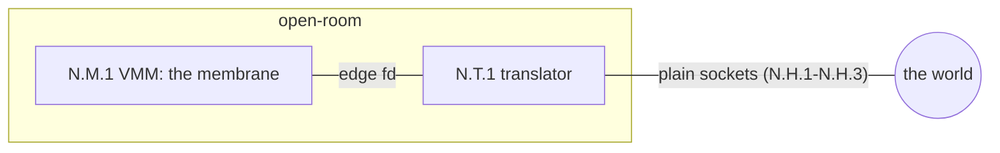
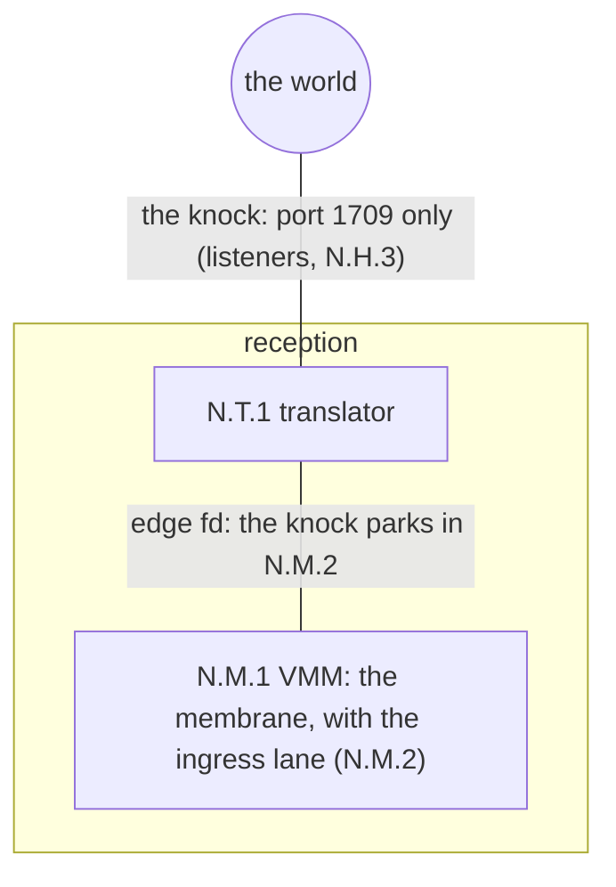
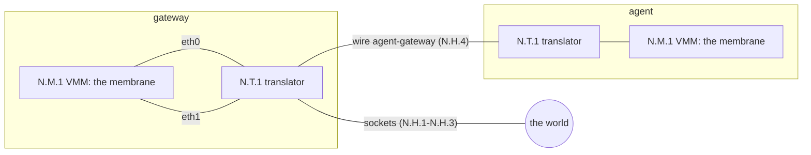
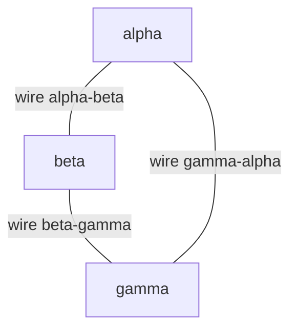
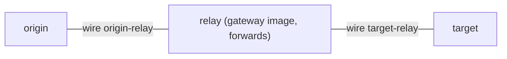

# Examples

Worked shapes, in the smallest number of verbs. Each example is
real: the gates in scripts/test/ exercise the same shapes.

## Networks

A machine's network is one flag at create: `--net SPEC`, where
SPEC is a comma list of nics, in interface order (eth0 first).
The kinds:

- `none` -- airgapped by construction (the default).
- `wire:NAME` -- a wire to the one other machine whose manifest
  names the same wire. Both ends judge every crossing. A wire
  with no world nic anywhere is a corridor: a passage between
  two rooms that never touches the world.
- `world` -- the internet, through the machine's own translator
  (N.T.1 in docs/NETWORK-MODEL.md): sockets, no tap, no
  capability (see docs/ROOTLESS-NETWORK.md).
- `world:PORT/tcp+PORT/udp` -- the world nic plus a port map: the
  named host ports become the machine's knockable surface, and
  nothing else reaches in. Ports join with `+`; commas separate
  nics.

The identifiers in the diagrams (N.M, N.T, N.H) are
docs/NETWORK-MODEL.md's maps.

### E1 -- One machine, world open

```
cella create open-room --net world
cella start open-room
cella gateway open-room open
```



Without the open verb, the same machine is a closed room: born
closed, dark by construction, nothing in or out. The guest is
192.168.210.2 and its gateway is 192.168.210.1; the
translator answers ARP and the gateway's echo at the edge. Every
egress frame parks at the membrane before the translator sees
it; every reply parks in the ingress lane (N.M.2) before the
guest sees it.

### E2 -- One machine, world reachable

```
cella create reception --net world:1709/tcp+1709/udp
cella start reception
cella gateway reception open
```



The world reaches reception only on port 1709 -- the knock, and
this room exists to receive it. A knock parks in the
ingress lane (N.M.2) and the machine keeps running; the guest
sees nothing before a release. Nested layers share the outer
machine's port space, so each layer must map a distinct knock
port (the nested gates use 1710 for the inner machine).

### E3 -- Two machines, one wire

```
cella create agent --net wire:agent-gateway
cella create gateway --rootfs gateway --net world,wire:agent-gateway
```



The wire's name is free (lowercase, digits, dash); pairing IS
the two manifests naming the same string. gateway is the
appliance:
the gateway image forwards, one nic to the world, one to its
agent, both judged at the gateway's own membrane.

### E4 -- Three machines, the triangle

Three rooms, three corridors, no world. Each machine holds two
nics. No routing guest is needed; any pair talks directly, and
each crossing is judged at both of its ends.

```
cella create alpha --net wire:alpha-beta,wire:gamma-alpha
cella create beta --net wire:alpha-beta,wire:beta-gamma
cella create gamma --net wire:beta-gamma,wire:gamma-alpha
```



Each machine is one N.M.1 with its own N.T.1; each wire is an
N.H.4. The guests address themselves (a wire imposes no
convention):
one subnet per wire, set at the console or by the image's init.

### E5 -- Three machines, the chain

Two wires; the middle machine forwards, so it runs the gateway
image. The cost is the law's, deliberately: origin-to-target is four
judged crossings, and the middle machine's book shows everything
it relayed.

```
cella create origin --net wire:origin-relay
cella create relay --rootfs gateway --net wire:origin-relay,wire:target-relay
cella create target --net wire:target-relay
```



Each machine is one N.M.1 with its own N.T.1; each wire is an
N.H.4.

### E6 -- More than three

A wire holds exactly two ends, always. Fan-out is a machine: N
members wanting one broadcast domain meet at a switch guest with
N wire nics (a planned appliance flavor). Fan-out is therefore
always judged and always witnessed -- there is no unjudged hub
anywhere in a cella topology.
