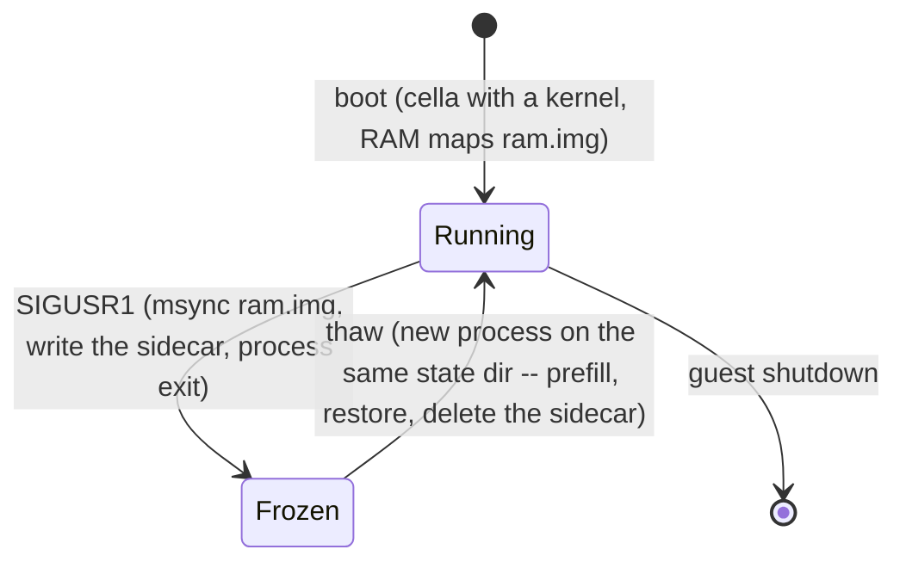
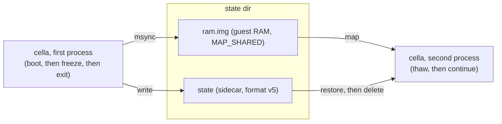
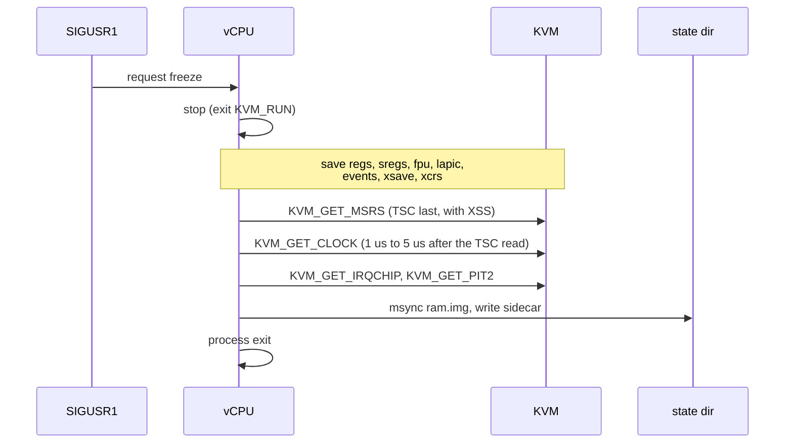
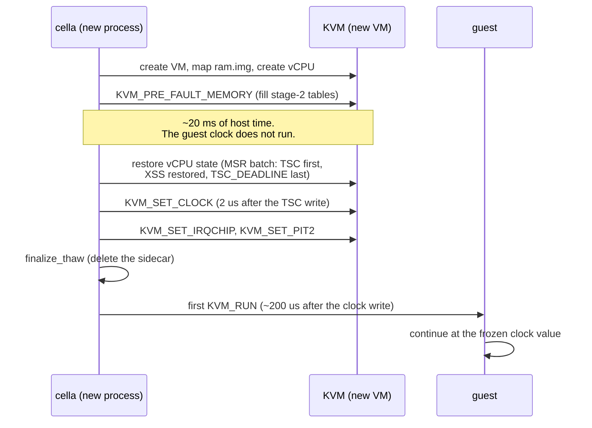
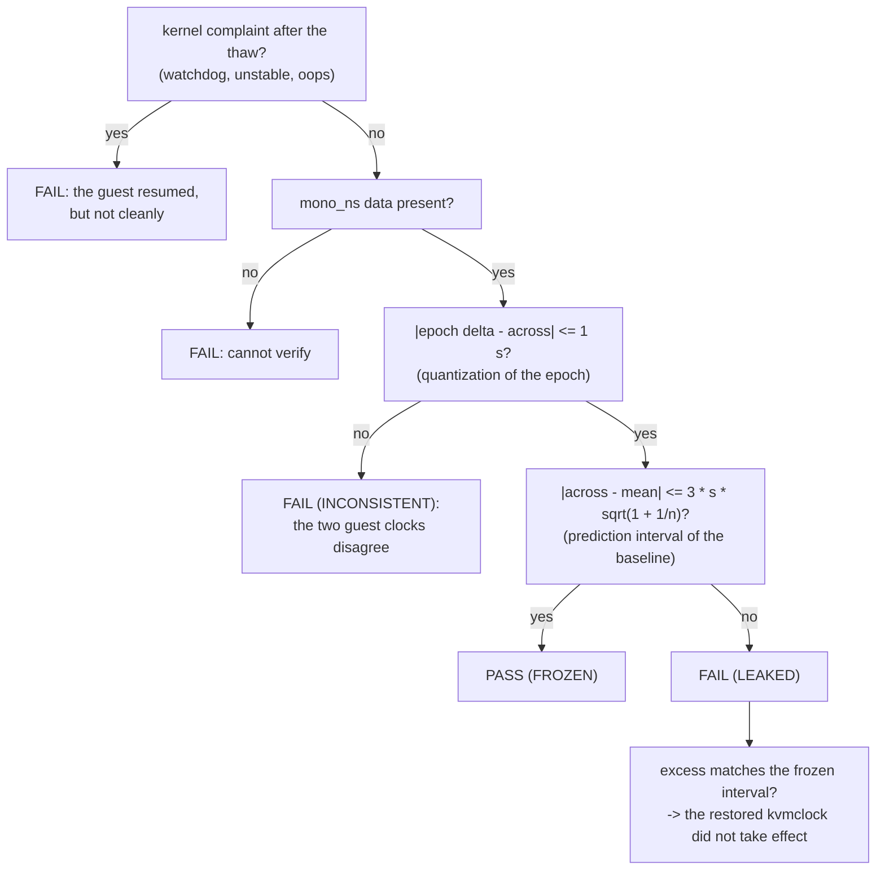
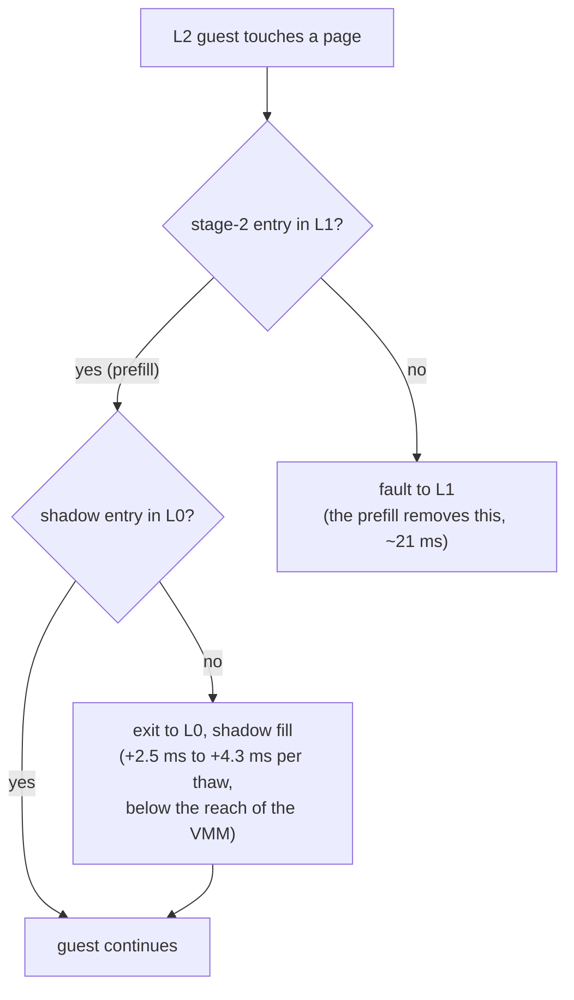
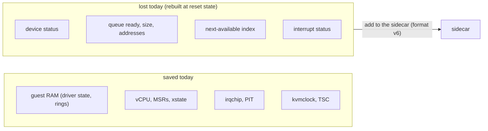

# Freeze and thaw: time and state

This document describes how cella freezes a VM, how it thaws the VM,
and what the guest can observe.

## The principle

A freeze must not exist for the guest. The guest stops, and the guest
continues. Time, timers, register state, and entropy continue from the
point of the stop. We call this the cryogenic principle. The probes in
`probes/` measure it, and the gates in the probes enforce it.

## Is time seamless for the guest?

Yes, within what we can measure, the freeze does not exist for the
guest:

- **Monotonic clock (kvmclock).** Continuous to microseconds. cella
  reads the TSC and the kvmclock 2 us to 5 us apart at the freeze, and
  writes them 2 us apart at the thaw. On bare metal, the heartbeat
  interval that contains the freeze differs from a normal interval by
  -0.128 ms, inside the measurement noise. A `sleep` that the freeze
  interrupts continues, and it completes its remaining time.
- **Wall clock (CLOCK_REALTIME).** Also frozen, by design. The restore
  does not use the KVM_CLOCK_REALTIME flag. The guest continues at the
  epoch of the freeze, 6 s behind the host after a freeze of 6 s. This
  is the design choice, not a defect.
- **TSC.** Restored to the frozen value, consistent with the kvmclock.
  The guest cannot compare the two clocks and find a discontinuity.
  cella does not call KVM_KVMCLOCK_CTRL: that call sets the
  PVCLOCK_GUEST_STOPPED flag, and the flag tells the guest that it was
  stopped. The guest does not need the flag. The command line contains
  tsc=reliable, thus the clocksource watchdog does not run, and the
  other watchdogs measure guest time, which does not advance across
  the freeze. The probes verify the absence of watchdog complaints
  after each thaw.
- **Timers, FPU and xstate, RNG state.** All continue from the point of
  the stop. This is the cryogenic principle applied to the full machine
  state. The RNG state persists across the thaw by design; do not
  reseed it.

Two qualifications:

1. The guest experiences its own resume. The first cycle after the thaw
   runs in real time. On nested KVM, 2.5 ms to 4 ms of outer-hypervisor
   work lands inside that cycle. On bare metal the same value is zero
   within the noise.
2. "Seamless" holds at the resolution that we can verify. The host-side
   pairing instrumentation proves the sub-millisecond continuity. No
   measurement from inside the guest can prove it. From inside, the
   guest can discover a freeze only through an external reference: a
   network peer, or a host clock.

## Architecture

Guest RAM is one MAP_SHARED file (`ram.img`). The RAM file is the
freeze image. A sidecar file (`state`) holds the vCPU state, the
irqchip and PIT state, the kvmclock value, and the format version.
`finalize_thaw` deletes the sidecar after a successful thaw, thus a
sidecar thaws one time only.



The Frozen state is only the two files. No process runs, and no time
passes for the guest. The sidecar thaws one time: the thaw deletes it,
and a second thaw of the same sidecar cannot occur.

A freeze and a thaw are two separate cella processes. The first
process runs from the boot to the freeze, and it exits. The second
process starts against the same state dir, and it runs from the thaw
onward. Nothing survives in memory between the two processes. The two
files are the complete guest.



## The freeze sequence

SIGUSR1 triggers the freeze. The sequence reads the TSC and the
kvmclock as close together as possible, because the thaw writes them
as close together as possible. A gap between the two reads becomes a
step in the clock of the guest.



## The thaw sequence

A run against a state dir that holds a sidecar thaws instead of
booting. The stage-2 prefill runs before the clock restore, thus its
cost falls outside the clock window of the guest.



Order rules, and the reason for each rule:

- The TSC read is the last read before the clock read, and the TSC
  write is the first write before the clock write. The pair must move
  together.
- MSR_IA32_TSC_DEADLINE is the last MSR in the batch. The deadline is a
  TSC value, thus the TSC must be correct first.
- MSR_IA32_XSS is in the batch. XRSTORS takes a #GP fault when the
  XCOMP_BV of an xsave area holds a component that XCR0 | IA32_XSS does
  not enable. A thaw without XSS panicked the guest on bare metal at
  its first context switch.
- XCR0 is written before the xsave area. KVM selects the components to
  load from the current XCR0.
- The prefill runs before the clock restore. A thaw makes a new KVM VM
  with empty stage-2 page tables. Without the prefill, the first
  heartbeat cycle of the guest pays one stage-2 fault for each page
  that it touches, and the clock of the guest counts that time
  (measured on nested KVM: ~25 ms; ~4 ms with the prefill).

## Measurement and gates

`make probe-freeze-thaw-clock` measures the crossing: the heartbeat
interval of the guest that contains the freeze, in nanoseconds, from
/proc/timer_list. The probe measures wake-up lateness after the thaw,
not a clock step. A clock step smaller than the remaining sleep does
not show in the crossing interval, because the wake-up is scheduled in
the same clock. The host-side pairing instrumentation bounds the clock
step itself to microseconds.



No gate uses a tuned constant. The 1 s bound is the resolution of the
epoch field. The prediction interval comes from the sample standard
deviation s of the n baseline intervals. `make probe-wallclock` applies
the same rule at boot: the drift tolerance is zero, and zero means that
the guest epoch lies inside the host window from spawn to observation.

The complaint gate runs first. Any watchdog, unstable, or oops line
from the guest kernel after the thaw is a FAIL, before the clock
verdict. `make probe-thaw-gate` runs the probe with a 30 s observation
window, because `make smoke-thaw` runs it with a window of 0 s, and a
window of 0 s can miss a late complaint.

## Results (2026-08-30)

| Machine    | Prefill | Difference against the baseline mean | Verdict |
|------------|---------|--------------------------------------|---------|
| nested KVM | off     | +23 ms to +28 ms                     | FAIL    |
| nested KVM | on      | +2.5 ms to +4.3 ms                   | FAIL    |
| bare metal | on      | -0.128 ms                            | PASS    |

Re-validation with the guest kernel 7.2.2 (2026-08-30, the pin moved
from 6.18.47): the same verdicts hold on both machines. On bare metal
the 30 s observation run gives +0.33 ms, inside the +/-1.11 ms
prediction interval, with no kernel complaints.

The excess is a constant cost of each thaw. It does not change with
the length of the freeze (0 s, 6 s, and 20 s give the same value). The
nested KVM remainder comes from the outer hypervisor: a thaw makes a
new VM, and the outer hypervisor rebuilds its shadow of the stage-2
tables on the first guest access. That work is below the reach of the
VMM. It does not exist on bare metal. Bare metal is the reference for
this gate.

## Nested VMM

On a nested machine, three layers run: L0 is the outer hypervisor, L1
is the host that runs cella, and L2 is the guest. A thaw makes a new
KVM VM in L1. The prefill fills the stage-2 tables of L1, and that
removes ~21 ms of the excess. But L0 keeps its own combined mapping
for L2, a shadow that L0 builds from the stage-2 tables of L1 and from
its own tables. L0 builds that shadow on the first access of L2 to
each page. The prefill cannot reach it: the L1 kernel performs the
prefill as normal memory writes, and L0 sees those writes as L1
activity, not as L2 accesses. The shadow of L0 stays cold.

In the first heartbeat cycle after the thaw, each page that the guest
touches therefore exits to L0 one time for the shadow fill. The exits
occur while the guest runs. The kvmclock tracks host real time while
the guest runs, thus the clock of the guest counts the stall: the
+2.5 ms to +4.3 ms remainder. The value is constant for each thaw
(the working set is the same), it does not change with the length of
the freeze, and no L1 ioctl can fill the structures of L0 in advance.



On bare metal, no L0 exists. The prefilled stage-2 tables are the only
translation layer, and the measurement confirms it: -0.128 ms, zero
within the noise. Bare metal is therefore the reference for this gate.

## Next steps: virtio state

The freeze does not save the virtio device state. This is the known
gap in the current design, and it is the next work item.

The guest keeps its driver state in RAM, and the freeze preserves RAM.
After the thaw, the drivers therefore believe that both devices are
configured and live: status DRIVER_OK, queue addresses programmed,
ring indices advanced. But the thaw constructs new MmioTransport
objects, and their state is the reset state: status 0, no queue ready,
and a next-available index of 0. The two sides disagree.

The smoke tests and the clock probes do not detect this, because the
heartbeat needs no virtio. The guest reads /proc and writes to the
serial console only. The first post-thaw disk request, and the first
post-thaw packet, meet a device that does not process its rings. The
request stays in the available ring, no interrupt arrives, and the
guest task blocks.

The state to save is small, and it lives in the transport, not in the
device:

- The device status register.
- For each queue: the ready flag, the size, the descriptor, available,
  and used ring addresses, and the next-available index. The rings
  themselves live in guest RAM, and the freeze already preserves them.
  The index is the private progress counter of the device, and RAM
  does not hold it.
- The interrupt status register.

An in-flight request needs no save: the freeze stops the vCPU first,
and the run loop completes each request that it starts, thus the rings
are quiet at the point of the save.

The verification follows the pattern of the clock probes. A test must
perform I/O after the thaw, not after the boot:

- Extend the network test: ping the guest after a thaw.
- Add a disk check: the guest reads and writes a file after a thaw,
  and it reports the result over the serial console.



## Reproduce

```
make smoke-thaw                                   # full workflow + both probes
make probe-freeze-thaw-clock                      # the crossing measurement
CELLA_THAW_PREFAULT=off make probe-freeze-thaw-clock   # the cold thaw
make probe-prefault-ept                           # explicit prefill variant
make probe-thaw-gate                              # 30 s complaint watch after the thaw
```
