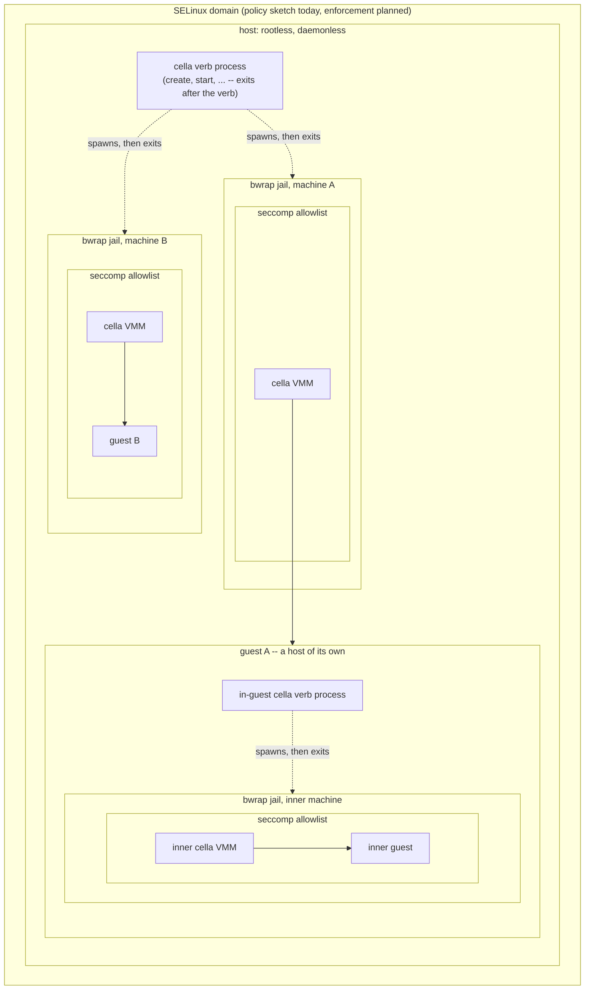
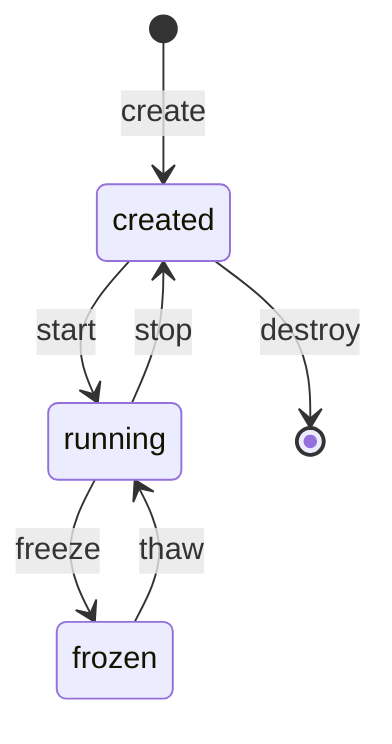

# The machine lifecycle

cella is the guest manager. One multi-call binary owns the verbs
under thin-CLI names (persona dispatch on argv0: cella-machine,
cella-universe, cella-build, cella-doctor, cella-vmm; cella-network
and cella-probe are real separate binaries), the state is files,
and no daemon
exists. The motto: rootless, daemonless, and seccomp, SELinux, and
jail confinement per VM.

## The security boundary

Confinement is per VM, and it nests. The verb process runs rootless
and exits; each machine runs inside its own jail; inside the jail,
the VMM installs its seccomp filter before the run loop; the guest
sees only KVM and the bound devices. SELinux frames the whole
process set.

The boundary nests with the machines: a guest that hosts machines
carries the same stack inside, one level down.



The inner jail is not optional, and it is real: the nested image
carries a static bwrap, the in-guest init drives create and start,
and the inner VMM runs inside its own jail with its own seccomp
filter, verified by the nested smoke battery on both machines. The
guest provisions its own tap through the same root verb (`cella setup
net --taps 1 --from 1`; the guest init is root, thus no sudo). The
one deliberate exception is the inception image: the clock probe
drives the inner cella through the flag interface, unjailed, because
the probe is the instrument, not the product.

| Layer   | Scope   | What it removes | Status |
|---------|---------|-----------------|--------|
| rootless | everything | No privilege to lose: CAP_NET_ADMIN lives in the cella-network binary as a file capability, granted once at install | enforced |
| bwrap jail | per VM | The filesystem, except the machine directory, the golden kernel, /dev/kvm, and the TAP; the pid, ipc, uts, user, and cgroup namespaces | enforced |
| seccomp | per VMM process | Every syscall outside the allowlist (~35 entries, each commented); socket(2) stays the canary | enforced |
| SELinux | per domain | Lateral movement between machine directories and device types | example policy only |

### The network privilege

Creating and addressing a TAP needs CAP_NET_ADMIN, thus the VMM never
does it. cella-network is the one holder: install.sh grants the
binary the capability as a file capability (setcap, the single root
moment, once). `cella-network setup --taps N` provisions the pool,
the deterministic MACs, the addresses, ip_forward, and the NAT --
no sudo, and the run converges: an interrupted setup heals on the
next call. `create` then allocates a free tap from the pool into
the manifest, rootless. TUNSETPERSIST is kernel-lifetime, thus
install.sh also enables cella-network.service, a oneshot that
recreates the pool at boot. Each pool tap owns a subnet: tap<n>
serves 192.168.<200+n>.0/24, the host at .1 and the guest at .2,
thus concurrent networked machines do not collide.

## The verbs



| Verb    | Effect | Purity |
|---------|--------|--------|
| build   | Makes a golden artifact (kernel, rootfs) of a named flavor | Rust orchestrates; the toolchain runs in the toolbox |
| create  | Stages a named machine from the golden artifacts. No process starts | Rust only |
| start   | Runs the machine. Detaches, writes the pid, signals readiness | Rust only |
| stop    | Ends the machine as fast as possible, and clears the transients: ram.img, the pid file, the console socket, and any stale sidecar. An emergency maneuver: in-flight state is disposable, and the next start boots fresh from the disk | Rust only |
| freeze  | Stops the machine and preserves the in-flight state: RAM, vCPU, clocks, devices. The next thaw resumes the same instant | Rust only |
| thaw    | Resumes a frozen machine | Rust only |
| enter   | Attaches the terminal to the serial console. An exit of the guest shell detaches | Rust only |
| destroy | Deletes the machine and its artifacts, once and for all | Rust only |
| branch  | Copies a still machine: a frozen source yields a frozen twin, a stopped source a fresh-bootable copy, a rock a rock. Records the layer digests | Rust only |
| archive | Turns a still machine into a rock: storage layers stay, runtime state goes, the manifest latches | Rust only |
| inspect | Attaches the disk of a still machine to a throwaway appliance, read-only; the detach destroys the appliance | Rust only |
| doctor  | check: the host facts, one line each. fix: repairs what the uid can (the pool via cella-network, absent goldens via build), deletes nothing. verify: recomputes each golden digest against its manifest, and the recorded layer digests of a machine (verify <vm>) | Rust only |
| probe   | The cryogenic diagnostics (cella-probe): wallclock, freeze-thaw-clock, sregs | Rust only |
| network | The pool (cella-network): the one CAP_NET_ADMIN holder | file capability |

The difference between stop and freeze is intent. Freeze preserves the
in-flight reality of the guest, and time stays cryogenic across the
gap. Stop declares the in-flight reality disposable, ends the VM with
no resumption in mind, and removes the transients: a stopped machine
is its manifest and its disk, nothing else.

## The universe family

`cella-universe` owns the operations on machines as artifacts:
branch, archive, and inspect. Every operation records the sha3-256
of each storage layer it touches into the manifest of the machine
it produces; `list` shows a short disk digest, `info` the full
set, and `doctor verify <vm>` recomputes them.

One rule spans the family: running is the only state a universe
verb refuses.

- **branch <existing-vm> <new-vm>** -- both names mandatory. A
  frozen source copies to a frozen twin (each sidecar thaws once;
  the twins share the CRNG state of the fork instant, deliberately
  -- divergence comes from the world, never a reseed). A stopped
  source copies to a fresh-bootable machine. A rock copies to a
  rock: the archived latch carries, because nothing resurrects by
  side effect. The copy's manifest carries `net none` always: the
  network identity of the source lives in its RAM, and a tap is a
  deliberate re-attachment, not an inheritance.
- **archive <vm>** -- a stopped or a frozen machine becomes a
  rock: the storage layers stay (disk.img, and ram.img where
  present), the runtime state goes (the sidecar: irqchip, vCPU,
  in-flight registers -- archiving a frozen machine deliberately
  discards its instant), and the manifest latches
  `state: archived`. A rock cannot be started by accident: start,
  thaw, and enter refuse it by name. Un-archiving, if it ever
  exists, is its own verb.
- **inspect <vm>** -- attach the disk of any still machine
  (archived, stopped, or frozen) as evidence, never as a machine:
  a temporary appliance named `<vm>-inspector` boots the stock
  rootfs, and the disk attaches as an external second virtio-blk,
  read-only at the device. The guest init mounts it at /rock with
  ro,noexec,nosuid,nodev,norecovery -- the content cannot execute,
  a dirty journal (a frozen source) replays nowhere, and the view
  of a frozen source is its crash-consistent instant. The terminal
  attaches; a detach destroys the inspector. The source never
  changes: a frozen source stays thaw-able, a rock stays a rock.

ram.img inspection stays host-side (the file is ordinary); a real
tool earns its place later.

## The homes

```
$HOME/.cella/
  config.json                    the defaults of create; flags override it
  kernel/<flavor>/bzImage        golden kernels (build)
  kernel/<flavor>/golden.json    the manifest: sha3-256, sources, inputs (mode 444)
  rootfs/<flavor>/rootfs.ext4    golden root filesystems (build)
  rootfs/<flavor>/golden.json    the manifest, same rule
  machines/<name>/
    manifest.json                the machine: flavors, memory, net, root mode,
                                 and, from the universe verbs, the layer digests
                                 and the archived latch
    disk.img                     the machine's own disk (a copy at create)
    ram.img                      guest RAM, present from the first start
    state                        the freeze sidecar, present only while frozen
    pid                          the VMM pid, present only while running
    console.sock                 the serial console, present only while running
    console.log                  the console transcript, append-only
    vmm.log                      the stderr of the VMM (operator instrumentation)
```

A directory is a machine. The manifest is per machine, thus every
verb's transaction is one directory: write to a temporary file, then
rename. No global state exists, no lock spans machines, and destroy
is the removal of exactly one directory. `create` fixes the machine's
configuration (flavors, memory, network, root mode) in the manifest;
`start` takes a name and nothing else.

`build` runs ad-hoc (`cella build kernel <flavor>`). It skips a
golden that exists only while the recorded input digests still
match; a changed init script or fragment rebuilds, and names the
input that changed. `--fresh` rebuilds unconditionally. Every build
writes
golden.json beside its artifact -- the digest of the artifact and
of the inputs that shaped it, born with the artifact, read-only.
Verification belongs to doctor: build makes, doctor judges, and
doctor deletes nothing.

The defaults of `create`: kernel `canonical`, rootfs `cella` -- the
interactive mvp image. `~/.cella/config.json` overrides any of the
defaults, and flags override both. The probes request the canonical
rootfs explicitly.

A networked machine claims its tap in the manifest, and the claim is
exclusive from create to destroy: `create --net auto` allocates the
lowest tap that is present on the host and claimed by no machine, and
an explicit `--net tapN` is refused when another manifest holds it.

`$HOME/.cella/` is the one artifact home. Every golden builds
natively through `cella build` (see src/build.rs), from the pinned
sources and the committed fragments and init scripts, inside the
toolbox. The repository carries the build inputs, not the artifacts.

## Golden flavors

| Axis   | Flavor    | Content |
|--------|-----------|---------|
| kernel | canonical | defconfig + the fragment; the proof kernel |
| kernel | nested    | + a KVM host stack and TUN |
| rootfs | canonical | busybox + the heartbeat init; the proof rootfs |
| rootfs | cella     | + a shell on the serial console; diagnostics only when the command line asks |
| rootfs | nested    | + a static cella and the canonical inner assets |
| rootfs | inception | nested + the static cella-probe |

## Process management, daemonless

`start` forks the VMM, detaches it, and returns when the machine
signals readiness (after the first KVM_RUN). The pid file and the
manifest are the registry; every verb reads facts from disk and
verifies them (`kill -0`, file presence) instead of trusting a
recorded state. A machine survives the death of every other cella
invocation, and the registry survives a host reboot: a stale pid file
is detected and cleared, and a `state` file means frozen, exactly as
the sidecar rule already works.

`enter` connects the terminal to `console.sock`. The VMM serves the
serial console on that socket, and it writes the console transcript
to its own log. The stderr of the VMM never enters the console: a
reader of the console must not see the instrumentation of the
operator.

## Migration of the make targets

The make targets migrate one at a time, and each migration
re-attributes the proof: the batteries run on both machines before
and after, and the results land in the documents. Sequence:

1. **Registry + create/destroy.** Pure file operations. Golden
   artifacts come from a copy of `dist/` in the first step, so that
   nothing depends on the build verb yet.
2. **start/stop + pid + readiness.** `make boot` becomes a wrapper;
   the sleep-based waits in the test scripts become readiness waits.
3. **freeze/thaw as verbs.** Signal by pid, not by process name.
   `make freeze`, `make thaw`, and `make demo` migrate.
4. **enter + console socket.** tmux leaves the dependency list. The
   seccomp filter gains the accept path and keeps socket(2) as the
   canary.
5. **build.** Rust orchestrates the downloads, the config merges, and
   one toolbox invocation per artifact; the assets scripts retire,
   the probes and the smoke tests read the golden paths, `dist/`
   disappears, and the proof artifacts re-verify at their new home.

Each step is a commit series with green batteries on both machines
before the next step begins.

Status (2026-08-31): all five steps are done, and the restructure
followed. The verbs run -- build (native, all six flavors, with
manifests, and the input-staleness check), create, start, enter,
freeze, thaw, stop, destroy, list, info, selftest, branch, archive,
inspect, doctor, probe, and network -- and the make targets are
thin wrappers over them. The thin-CLI names exist as personas of
the one binary (cella-machine, cella-universe, cella-build,
cella-doctor, cella-vmm), with cella-network and cella-probe as
real binaries; the jail runs the machine under the cella-vmm name.
The security-profile paths per CLI live under security/profiles/;
their contents come with the shakedown work. dist/, the assets
scripts, tap.sh, and the probes/ crates are gone; the diagnostics
are cella-probe subcommands, and no production path compiles
anything at run time.
