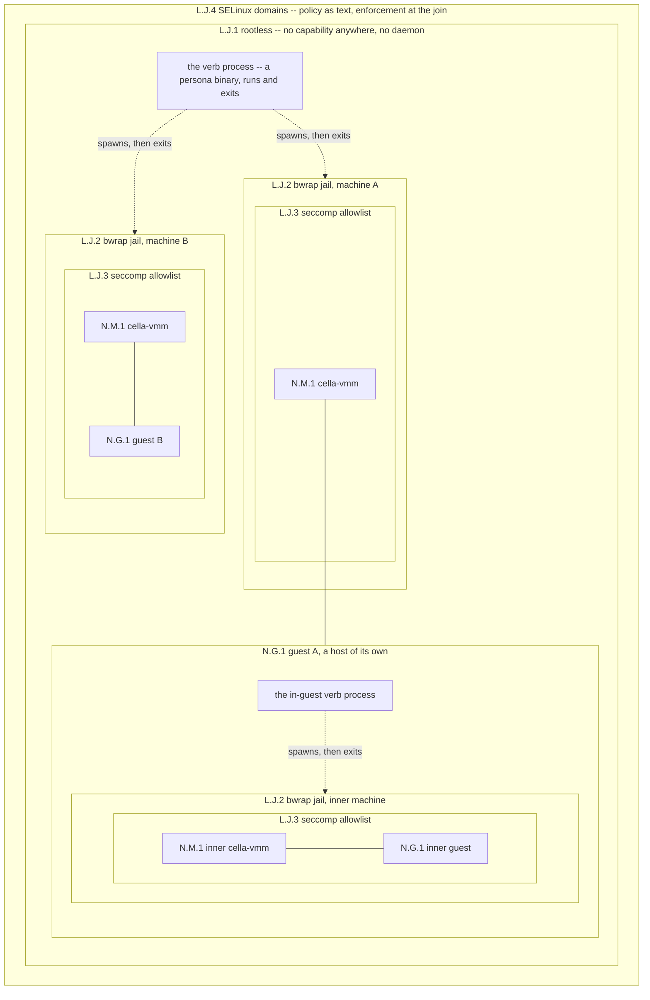
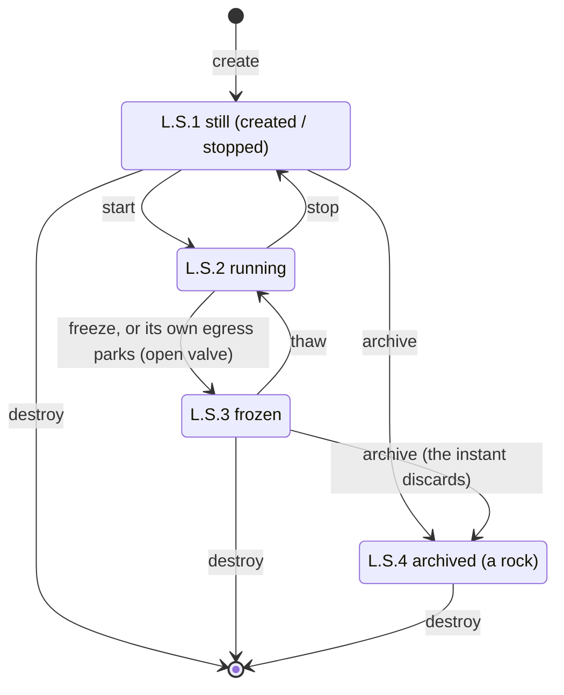

# The machine lifecycle

cella is the guest manager. Ten crates own the verbs, one binary
per persona (1.6.13): the cella shim routes each verb to its
persona binary by one exec and holds no verb itself. The state is
files, and no daemon exists. The motto: rootless, daemonless, and
seccomp, SELinux, and jail confinement per binary.

## The security boundary

NOTE: The confinement of the cella thin-CLI set is partial. The
plan and the progress are tracked in tasks/PHASE2-security.md.

Confinement is per VM, and it nests:

1. The verb process runs rootless and exits.
2. Each machine runs inside its own jail.
3. Inside the jail, the VMM installs its seccomp filter before
   the run loop.
4. The guest sees only KVM and the bound devices.
5. SELinux frames the whole process set.

The boundary nests with the machines: a guest that hosts machines
carries the same stack inside, one level down.



The inner jail is not optional, and it is real: the nested image
carries a static bwrap, the in-guest init drives create and start,
and the inner VMM runs inside its own jail with its own seccomp
filter, verified by the nested smoke battery on both machines. The
guest runs the same rootless network one level down
(docs/ROOTLESS-NETWORK.md): the in-guest static cella spawns the
inner machine's translator, and no privilege exists at any depth (the guest init is root inside its
own guest, and needs nothing from the layer above). The
one deliberate exception is the inception image: the clock probe
drives the inner cella through the flag interface, unjailed, because
the probe is the instrument, not the product.

| Layer   | Scope   | What it removes | Status |
|---------|---------|-----------------|--------|
| rootless | everything | No privilege to lose: no capability on any binary, no setuid, no privileged daemon; the one root moment is make install's host provisioning | enforced |
| bwrap jail | per VMM | The filesystem, except the machine directory, the golden kernel, /dev/kvm, and the system libraries (read-only); the pid, ipc, uts, user, and cgroup namespaces. The nics arrive as inherited edge fds | enforced for the VMM; the other personas jail at 1.6.14g (tasks/PHASE2-security.md) |
| seccomp | per binary | Every syscall outside the allowlist; socket(2) stays the canary in the VMM's list | enforced in the VMM before the run loop; the other lists ship and stay provisional until the join |
| SELinux | per domain | Lateral movement between machine directories and device types | policy ships as text (security/profiles/); enforcement is the join |

### The network, rootless

No network privilege exists (1.6.14e). The network is one
translator process per machine (`cella-network edge <vm>`,
N.T.1 in docs/NETWORK-MODEL.md's maps), spawned by start, killed
by destroy or by its own tether (docs/ROOTLESS-NETWORK.md, "The
translator"), holding plain sockets (N.H.1-N.H.4) and no
capability. No tap, no bridge, no NAT rule, and no boot service
exist on the host. The design record is docs/ROOTLESS-NETWORK.md
and the law is docs/NETWORK-MODEL.md.

## The verbs



| Verb    | Effect | Purity |
|---------|--------|--------|
| build   | Makes a golden artifact (kernel, rootfs) of a named flavor | Rust orchestrates; the toolchain runs in the toolbox |
| create  | Stages a named machine from the golden artifacts. No process starts | Rust only |
| start   | Runs the machine. Detaches, writes the pid, signals readiness | Rust only |
| stop    | Ends the machine as fast as possible, and clears the transients: ram.img, the pid file, the console socket, and any stale sidecar. An emergency maneuver: in-flight state is disposable, and the next start boots fresh from the disk | Rust only |
| freeze  | Stops the machine and preserves the in-flight state: RAM, vCPU, clocks, devices, held operations. A machine with an open valve also freezes itself on a park (docs/NETWORK-MODEL.md, "The membrane": the park is the freeze). The next thaw resumes the same instant | Rust only |
| thaw    | Resumes a frozen machine | Rust only |
| enter   | Attaches the terminal to the serial console -- the lab flavor alone (debug-assertions on). The release flavor has no console, and enter refuses; the machine is observed through files, verbs, and the chronicle. An exit of the guest shell detaches | Rust only |
| destroy | Deletes the machine and its artifacts, once and for all | Rust only |
| branch  | Copies a still machine: a frozen source yields a frozen twin, a stopped source a fresh-bootable copy, a rock a rock. Records the layer digests | Rust only |
| archive | Turns a still machine into a rock: storage layers stay, runtime state goes, the manifest latches | Rust only |
| inspect | Attaches the disk of a still machine to a throwaway appliance, read-only; the detach destroys the appliance | Rust only |
| doctor  | check: the host facts, one line each. fix: repairs what the uid can (the sub-id delegation, absent goldens via build), deletes nothing. verify: recomputes each golden digest against its manifest, and the recorded layer digests of a machine (verify <vm>) | Rust only |
| probe   | The cryogenic diagnostics (cella-probe): wallclock, freeze-thaw-clock, sregs | Rust only |
| network | The translator (cella-network edge <vm>, N.T.1): one per machine, spawned by start; not an operator's verb | Rust only |
| gateway | The membrane surface (N.X.1): show [incoming|outgoing], release <id>, refuse <id>, inspect <id> (frozen holds only), open, close. A machine is born closed (nothing in or out); open arms the membrane, never a free flow; a release delivers one operation, and no allow outlives its decision | Rust only |

The difference between stop and freeze is intent. Freeze preserves the
in-flight reality of the guest, and time stays cryogenic across the
gap. Stop declares the in-flight reality disposable, ends the VM with
no resumption in mind, and removes the transients: a stopped machine
is its manifest and its disk, nothing else.

## The universe family

`cella-universe` owns the operations on machines as artifacts:
branch, archive, and inspect. Every operation records the sha3-256
of each storage layer it touches into the manifest of the machine
it produces; `list` shows a short disk digest, `info` the full
set, and `doctor verify <vm>` recomputes them.

One rule spans the family: running is the only state a universe
verb refuses.

- **branch <existing-vm> <new-vm>** -- both names mandatory. A
  frozen source copies to a frozen twin (each sidecar thaws once;
  the twins share the CRNG state of the fork instant, deliberately
  -- divergence comes from the world, never a reseed). A stopped
  source copies to a fresh-bootable machine. A rock copies to a
  rock: the archived latch carries, because nothing resurrects by
  side effect. The copy's manifest carries `net none` always: the
  network identity of the source lives in its RAM, and a nic is a
  deliberate re-attachment, not an inheritance.
- **archive <vm>** -- a stopped or a frozen machine becomes a
  rock: the storage layers stay (disk.img, and ram.img where
  present), the runtime state goes (the sidecar: irqchip, vCPU,
  in-flight registers -- archiving a frozen machine deliberately
  discards its instant), and the manifest latches
  `state: archived`. A rock cannot be started by accident: start,
  thaw, and enter refuse it by name. Un-archiving, if it ever
  exists, is its own verb.
- **inspect <vm>** -- attach the disk of any still machine
  (archived, stopped, or frozen) as evidence, never as a machine:
  a temporary appliance named `<vm>-inspector` boots the stock
  rootfs, and the disk attaches as an external second virtio-blk,
  read-only at the device. The guest init mounts it at /rock with
  ro,noexec,nosuid,nodev,norecovery -- the content cannot execute,
  a dirty journal (a frozen source) replays nowhere, and the view
  of a frozen source is its crash-consistent instant. The terminal
  attaches; a detach destroys the inspector. The source never
  changes: a frozen source stays thaw-able, a rock stays a rock.

ram.img inspection stays host-side (the file is ordinary); a real
tool earns its place later.

## The homes

```
$HOME/.cella/
  bin/                           the installed thin CLIs (make install); the
                                 spawn's ACLs make the home traversable per
                                 machine sub-uid, thus the jail can read them
  config.json                    the defaults of create; flags override it
  build/kernel/, build/rootfs/   the build verb's workshop: pinned upstream
                                 sources and build trees, one cache per host
                                 (safe to delete; the next build refetches)
  build/scripts/                 the installed build inputs (fragments, init
                                 scripts); the checkout's scripts/build/ wins
                                 when the build runs from a checkout
  kernel/<flavor>/bzImage        golden kernels (build)
  kernel/<flavor>/golden.json    the manifest: sha3-256, sources, inputs (mode 444)
  rootfs/<flavor>/rootfs.ext4    golden root filesystems (build)
  rootfs/<flavor>/golden.json    the manifest, same rule
  machines/<name>/
    manifest.json                the machine: flavors, memory, net, root mode,
                                 and, from the universe verbs, the layer
                                 digests and the latch
    disk.img                     the machine's own disk (a copy at create)
    ram.img                      guest RAM, present from the first start
    state                        the freeze sidecar, present only while frozen
    pid                          the VMM pid, present only while running
    console.sock                 the serial console, present only while running
    console.log                  the console transcript, append-only
    vmm.log                      the stderr of the VMM (operator instrumentation)
    valve                        N.F.1, the valve posture, one word (born
                                 closed; the gateway CLI alone writes it)
    verdict                      N.F.2, framed Decision messages, appended by
                                 the gateway CLI, read by the VMM on the kick
    network/ledger               N.F.3, the chronicle: Parked, Released,
                                 Lapsed, framed
                                 (append-only; it survives stop, as a chronicle
                                 must)
    edge.sock                    N.F.4, the translator's listener; each VMM
                                 run connects at spawn, one connection per nic
                                 (docs/ROOTLESS-NETWORK.md, "The edge")
    edge.pid                     N.F.5, the translator's pid; destroy kills
                                 by it
    edge.log                     N.F.6, the translator's transcript,
                                 append-only
```

The chronicle is the machine's append-only record of what its
operations did -- parked, released, lapsed, when and to where --
written as history, never read back as truth.

A directory is a machine. The manifest is per machine, thus every
verb's transaction is one directory:

1. Write to a temporary file.
2. Rename it over the target.

No global state exists, no lock spans machines, and destroy
is the removal of exactly one directory. `create` fixes the machine's
configuration (flavors, memory, network, root mode) in the manifest;
`start` takes a name and nothing else.

`build` runs ad-hoc (`cella build kernel <flavor>`):

1. It skips a golden that exists only while the recorded input
   digests still match.
2. A changed init script or fragment rebuilds, and names the
   input that changed. `--fresh` rebuilds unconditionally.
3. Every build writes golden.json beside its artifact -- the
   digest of the artifact and of the inputs that shaped it, born
   with the artifact, read-only.
Verification belongs to doctor: build makes, doctor judges, and
doctor deletes nothing.

The defaults of `create`: kernel `canonical`, rootfs `cella` -- the
interactive mvp image. `~/.cella/config.json` overrides any of the
defaults, and flags override both. The probes request the canonical
rootfs explicitly.

A machine's network is fixed at create: `--net SPEC`, a comma
list of nics -- `none` (the default), `world[:PORT/proto+...]`,
or `wire:NAME` (docs/EXAMPLES.md walks the shapes). No host
object is claimed, because none exists.

`$HOME/.cella/` is the one artifact home. Every golden builds
natively through `cella build` (crates/cella-build), from the pinned
sources and the committed fragments and init scripts, inside the
toolbox. The repository carries the build inputs, not the artifacts.

## Golden flavors

| Axis   | Flavor    | Content |
|--------|-----------|---------|
| kernel | canonical | defconfig + the fragment; the proof kernel |
| kernel | nested    | + a KVM host stack and TUN |
| rootfs | canonical | busybox + the heartbeat init; the proof rootfs |
| rootfs | cella     | + a shell on the serial console; diagnostics only when the command line asks |
| rootfs | nested    | + a static cella and the canonical inner assets |
| rootfs | gateway   | canonical + the appliance init: agent side from cella_pair=, plain forwarding (docs/EXAMPLES.md, E3 and E5) |
| rootfs | inception | nested + the static cella-probe |

## Process management, daemonless

The walk of one start:

1. `start` forks the VMM and detaches it.
2. It returns when the machine signals readiness (after the
   first KVM_RUN).
3. The pid file and the manifest are the registry: every verb
   reads facts from disk and verifies them (`kill -0`, file
   presence) instead of trusting a recorded state. A machine survives the death of every other cella
invocation, and the registry survives a host reboot: a stale pid file
is detected and cleared, and a `state` file means frozen, exactly as
the sidecar rule already works.

`enter` connects the terminal to `console.sock` -- in the lab
flavor alone. The release VMM has no console: no console.sock, no
console.log, no ear, no mouth; its guest's ttyS0 bytes are consumed
and discarded, and its only crossings are the disk at birth and
decided frames at the membrane. In the lab flavor the VMM serves
the serial console on the socket and writes the transcript to its
own log; the stderr of the VMM never enters the console, because a
reader of the console must not see the instrumentation of the
operator.

## Migration of the make targets

The make targets migrate one at a time, and each migration
re-attributes the proof: the batteries run on both machines before
and after, and the results land in the documents. Sequence:

1. **Registry + create/destroy.** Pure file operations. Golden
   artifacts come from a copy of `dist/` in the first step, so that
   nothing depends on the build verb yet.
2. **start/stop + pid + readiness.** `make boot` becomes a wrapper;
   the sleep-based waits in the test scripts become readiness waits.
3. **freeze/thaw as verbs.** Signal by pid, not by process name.
   `make freeze`, `make thaw`, and the shell gate (now
   `make smoke-shell`) migrate.
4. **enter + console socket.** tmux leaves the dependency list. The
   seccomp filter gains the accept path and keeps socket(2) as the
   canary.
5. **build.** Rust orchestrates the downloads, the config merges, and
   one toolbox invocation per artifact; the assets scripts retire,
   the probes and the smoke tests read the golden paths, `dist/`
   disappears, and the proof artifacts re-verify at their new home.

Each step is a commit series with green batteries on both machines
before the next step begins.

Status (2026-08-31, revised 2026-09-03): all five steps are
done, and the restructure followed. The verbs run, and the make
targets are thin wrappers over them. The one binary then split
into ten crates (1.6.13): every persona is a real binary behind
the routing shim, the jail runs the machine under the cella-vmm
name, and the per-CLI profiles live under security/profiles/.
dist/, the assets scripts, tap.sh, the probes/ crates, and the
whole tap network (1.6.14e) are gone; the diagnostics are
cella-probe subcommands, and no production path compiles anything
at run time.
