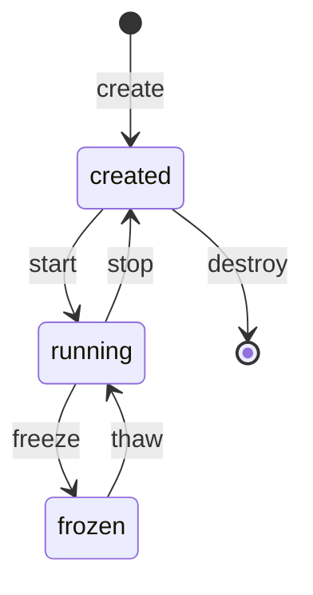

# The machine lifecycle

cella is the guest manager. One binary owns the verbs, the state is
files, and no daemon exists. The motto: rootless, daemonless, and
seccomp, SELinux, and jail confinement per VM.

## The verbs



| Verb    | Effect | Purity |
|---------|--------|--------|
| build   | Makes a golden artifact (kernel, rootfs) of a named flavor | Rust orchestrates; the toolchain runs in the toolbox |
| create  | Stages a named machine from the golden artifacts. No process starts | Rust only |
| start   | Runs the machine. Detaches, writes the pid, signals readiness | Rust only |
| stop    | Ends the machine as fast as possible. An emergency maneuver: in-flight state is disposable, and the next start boots fresh | Rust only |
| freeze  | Stops the machine and preserves the in-flight state: RAM, vCPU, clocks, devices. The next thaw resumes the same instant | Rust only |
| thaw    | Resumes a frozen machine | Rust only |
| enter   | Attaches the terminal to the serial console. An exit of the guest shell detaches | Rust only |
| destroy | Deletes the machine and its artifacts, once and for all | Rust only |

The difference between stop and freeze is intent. Freeze preserves the
in-flight reality of the guest, and time stays cryogenic across the
gap. Stop declares the in-flight reality disposable and ends the VM
with no resumption in mind.

## The homes

```
$HOME/.cella/
  kernel/<flavor>/bzImage        golden kernels (build)
  rootfs/<flavor>/rootfs.ext4    golden root filesystems (build)
  machines/<name>/
    manifest.json                the machine: flavor, memory, net, root mode, state
    disk.img                     the machine's own disk (a copy at create)
    ram.img                      guest RAM, present from the first start
    state                        the freeze sidecar, present only while frozen
    pid                          the VMM pid, present only while running
    console.sock                 the serial console, present only while running
```

A directory is a machine. The manifest is per machine, thus every
verb's transaction is one directory: write to a temporary file, then
rename. No global state exists, no lock spans machines, and destroy
is the removal of exactly one directory. `create` fixes the machine's
configuration (flavors, memory, network, root mode) in the manifest;
`start` takes a name and nothing else.

`build` runs when `create` misses a golden artifact, and it runs
ad-hoc: `cella build kernel <flavor>`.

The repository's `dist/` stays the proof path: the probes and the
smoke tests pin against it, unchanged. `$HOME/.cella/` is the
operational home. One recipe feeds both.

## Golden flavors

| Axis   | Flavor    | Content |
|--------|-----------|---------|
| kernel | canonical | defconfig + the fragment; the proof kernel |
| kernel | nested    | + a KVM host stack and TUN |
| rootfs | canonical | busybox + the heartbeat init; the proof rootfs |
| rootfs | cella     | + a shell on the serial console; diagnostics only when the command line asks |
| rootfs | nested    | + a static cella and the canonical inner assets |
| rootfs | inception | nested + the static clock probe |

## Process management, daemonless

`start` forks the VMM, detaches it, and returns when the machine
signals readiness (after the first KVM_RUN). The pid file and the
manifest are the registry; every verb reads facts from disk and
verifies them (`kill -0`, file presence) instead of trusting a
recorded state. A machine survives the death of every other cella
invocation, and the registry survives a host reboot: a stale pid file
is detected and cleared, and a `state` file means frozen, exactly as
the sidecar rule already works.

`enter` connects the terminal to `console.sock`. The VMM serves the
serial console on that socket, and it writes the console transcript
to its own log. The stderr of the VMM never enters the console: a
reader of the console must not see the instrumentation of the
operator.

## Migration of the make targets

The make targets migrate one at a time, and each migration
re-attributes the proof: the batteries run on both machines before
and after, and the results land in the documents. Sequence:

1. **Registry + create/destroy.** Pure file operations. Golden
   artifacts come from a copy of `dist/` in the first step, so that
   nothing depends on the build verb yet.
2. **start/stop + pid + readiness.** `make boot` becomes a wrapper;
   the sleep-based waits in the test scripts become readiness waits.
3. **freeze/thaw as verbs.** Signal by pid, not by process name.
   `make freeze`, `make thaw`, and `make demo` migrate.
4. **enter + console socket.** tmux leaves the dependency list. The
   seccomp filter gains the accept path and keeps socket(2) as the
   canary.
5. **build.** Rust orchestrates the downloads, the config merges, and
   one toolbox invocation per artifact; the assets scripts retire.
   `make dist` and `dist-nested` become wrappers, and the proof
   artifacts re-verify.

Each step is a commit series with green batteries on both machines
before the next step begins.
