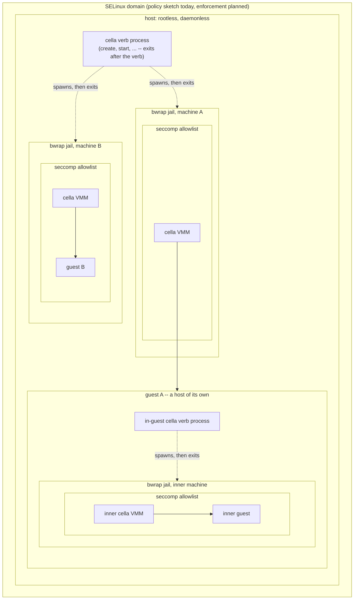
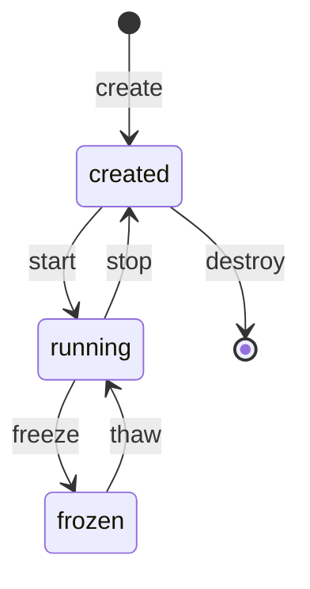

# The machine lifecycle

cella is the guest manager. One binary owns the verbs, the state is
files, and no daemon exists. The motto: rootless, daemonless, and
seccomp, SELinux, and jail confinement per VM.

## The security boundary

Confinement is per VM, and it nests. The verb process runs rootless
and exits; each machine runs inside its own jail; inside the jail,
the VMM installs its seccomp filter before the run loop; the guest
sees only KVM and the bound devices. SELinux frames the whole
process set.

The boundary nests with the machines: a guest that hosts machines
carries the same stack inside, one level down.



The inner jail is not optional: the nested images will carry a static
bwrap, and the in-guest verbs will run it exactly as the host does.
Today the inner cella runs through the flag interface without a jail
(the probes drive it directly); the static bwrap and the in-guest
verb recursion are the next work item after this branch merges.

| Layer   | Scope   | What it removes | Status |
|---------|---------|-----------------|--------|
| rootless | everything | No privilege to lose: the one CAP_NET_ADMIN moment is the network setup, out of band | enforced |
| bwrap jail | per VM | The filesystem, except the machine directory, the golden kernel, /dev/kvm, and the TAP; the pid, ipc, uts, user, and cgroup namespaces | enforced |
| seccomp | per VMM process | Every syscall outside the allowlist (~26 entries, each commented); socket(2) stays the canary | enforced |
| SELinux | per domain | Lateral movement between machine directories and device types | example policy only |

### The network privilege

Creating and addressing a TAP needs CAP_NET_ADMIN, thus the VMM never
does it. The setup provisions a pool of persistent taps and the NAT
once, with sudo, out of band; `create` then allocates a free tap from
the pool into the manifest, rootless. The verb: `sudo $(which cella)
setup net --taps N`, the one verb that asks for privilege. Each pool
tap owns a subnet: tap<n> serves 192.168.<200+n>.0/24, the host at .1
and the guest at .2, thus concurrent networked machines do not
collide. A later step can
evaluate user-mode networking (passt), which would remove the
privileged moment entirely at the cost of a new integration.

## The verbs



| Verb    | Effect | Purity |
|---------|--------|--------|
| build   | Makes a golden artifact (kernel, rootfs) of a named flavor | Rust orchestrates; the toolchain runs in the toolbox |
| create  | Stages a named machine from the golden artifacts. No process starts | Rust only |
| start   | Runs the machine. Detaches, writes the pid, signals readiness | Rust only |
| stop    | Ends the machine as fast as possible, and clears the transients: ram.img, the pid file, the console socket, and any stale sidecar. An emergency maneuver: in-flight state is disposable, and the next start boots fresh from the disk | Rust only |
| freeze  | Stops the machine and preserves the in-flight state: RAM, vCPU, clocks, devices. The next thaw resumes the same instant | Rust only |
| thaw    | Resumes a frozen machine | Rust only |
| enter   | Attaches the terminal to the serial console. An exit of the guest shell detaches | Rust only |
| destroy | Deletes the machine and its artifacts, once and for all | Rust only |

The difference between stop and freeze is intent. Freeze preserves the
in-flight reality of the guest, and time stays cryogenic across the
gap. Stop declares the in-flight reality disposable, ends the VM with
no resumption in mind, and removes the transients: a stopped machine
is its manifest and its disk, nothing else.

## The homes

```
$HOME/.cella/
  config.json                    the defaults of create; flags override it
  kernel/<flavor>/bzImage        golden kernels (build)
  rootfs/<flavor>/rootfs.ext4    golden root filesystems (build)
  machines/<name>/
    manifest.json                the machine: flavor, memory, net, root mode, state
    disk.img                     the machine's own disk (a copy at create)
    ram.img                      guest RAM, present from the first start
    state                        the freeze sidecar, present only while frozen
    pid                          the VMM pid, present only while running
    console.sock                 the serial console, present only while running
```

A directory is a machine. The manifest is per machine, thus every
verb's transaction is one directory: write to a temporary file, then
rename. No global state exists, no lock spans machines, and destroy
is the removal of exactly one directory. `create` fixes the machine's
configuration (flavors, memory, network, root mode) in the manifest;
`start` takes a name and nothing else.

`build` runs when `create` misses a golden artifact, and it runs
ad-hoc: `cella build kernel <flavor>`.

The defaults of `create`: kernel `canonical`, rootfs `cella` -- the
interactive mvp image. `~/.cella/config.json` overrides any of the
defaults, and flags override both. The probes request the canonical
rootfs explicitly.

A networked machine claims its tap in the manifest, and the claim is
exclusive from create to destroy: `create --net auto` allocates the
lowest tap that is present on the host and claimed by no machine, and
an explicit `--net tapN` is refused when another manifest holds it.

`$HOME/.cella/` is the one artifact home. Every golden builds
natively through `cella build` (see src/build.rs), from the pinned
sources and the committed fragments and init scripts, inside the
toolbox. The repository carries the build inputs, not the artifacts.

## Golden flavors

| Axis   | Flavor    | Content |
|--------|-----------|---------|
| kernel | canonical | defconfig + the fragment; the proof kernel |
| kernel | nested    | + a KVM host stack and TUN |
| rootfs | canonical | busybox + the heartbeat init; the proof rootfs |
| rootfs | cella     | + a shell on the serial console; diagnostics only when the command line asks |
| rootfs | nested    | + a static cella and the canonical inner assets |
| rootfs | inception | nested + the static clock probe |

## Process management, daemonless

`start` forks the VMM, detaches it, and returns when the machine
signals readiness (after the first KVM_RUN). The pid file and the
manifest are the registry; every verb reads facts from disk and
verifies them (`kill -0`, file presence) instead of trusting a
recorded state. A machine survives the death of every other cella
invocation, and the registry survives a host reboot: a stale pid file
is detected and cleared, and a `state` file means frozen, exactly as
the sidecar rule already works.

`enter` connects the terminal to `console.sock`. The VMM serves the
serial console on that socket, and it writes the console transcript
to its own log. The stderr of the VMM never enters the console: a
reader of the console must not see the instrumentation of the
operator.

## Migration of the make targets

The make targets migrate one at a time, and each migration
re-attributes the proof: the batteries run on both machines before
and after, and the results land in the documents. Sequence:

1. **Registry + create/destroy.** Pure file operations. Golden
   artifacts come from a copy of `dist/` in the first step, so that
   nothing depends on the build verb yet.
2. **start/stop + pid + readiness.** `make boot` becomes a wrapper;
   the sleep-based waits in the test scripts become readiness waits.
3. **freeze/thaw as verbs.** Signal by pid, not by process name.
   `make freeze`, `make thaw`, and `make demo` migrate.
4. **enter + console socket.** tmux leaves the dependency list. The
   seccomp filter gains the accept path and keeps socket(2) as the
   canary.
5. **build.** Rust orchestrates the downloads, the config merges, and
   one toolbox invocation per artifact; the assets scripts retire,
   the probes and the smoke tests read the golden paths, `dist/`
   disappears, and the proof artifacts re-verify at their new home.

Each step is a commit series with green batteries on both machines
before the next step begins.

Status (2026-08-31): all five steps are done. The verbs run --
build (native, all six flavors), create, start, enter, freeze, thaw,
stop, destroy, list, info, selftest, and the root verb setup net --
and the make targets are thin wrappers over them. dist/, the assets
scripts, and tap.sh are gone; the tests and the probes read the
golden paths under CELLA_HOME. The guest init scripts and the kernel
fragments stay in the repository as the build inputs.
