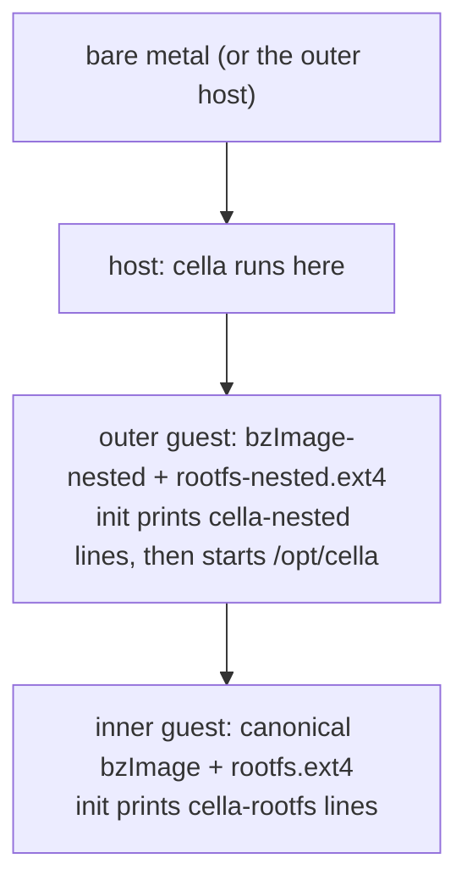
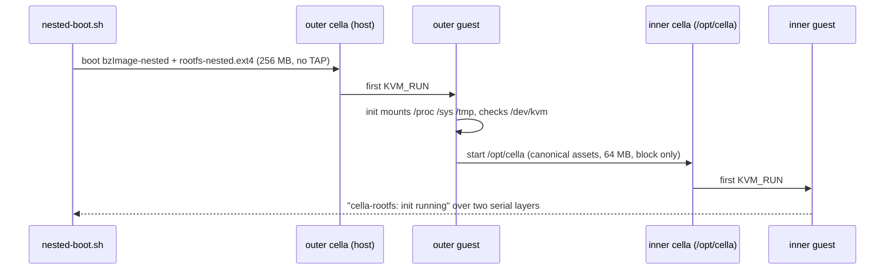

# Nested boot: cella hosts cella

This document describes the nested smoke test: a cella guest that runs
cella, which boots an inner guest. It covers the purpose, the
artifacts, the boot path, the pass criteria, and the results.

## Why

1. **It closes the loop on the thaw investigation.** The freeze and
   thaw work attributed the nested remainder to the outer hypervisor
   (see docs/FREEZE-THAW.md). With cella as the outer layer, that layer
   is our code. We can measure what a boot or a thaw costs an inner
   guest through cella, with instruments on both sides.
2. **It is the strongest exercise of cella as a host.** A guest that
   runs a VMM uses the CPUID filter (VMX must pass through), /dev/kvm,
   and the interrupt paths harder than a plain Linux guest does.
3. **It is the recursion primitive.** A world that can contain worlds
   is a required property for the larger goal. The boot is the first
   step; a freeze of a hypervisor guest is a later one.

## The layers



On the nested development host the test adds one more layer below L0.
The test passes there at a depth of three hypervisor layers.

## Artifacts

The canonical dist/bzImage and dist/rootfs.ext4 are proof artifacts.
The nested feature does not change them: the inner guest boots them
unmodified. The nested artifacts carry the -nested suffix, and their
own targets build them.

| Artifact               | Content                                            | Built by       |
|------------------------|----------------------------------------------------|----------------|
| dist/bzImage-nested    | canonical kernel fragment + a KVM host stack       | make dist-nested |
| dist/rootfs-nested.ext4| canonical busybox root + /opt (static cella, canonical bzImage, canonical rootfs.ext4) + the nested init | make dist-nested |
| static cella           | crt-static build from the toolbox                  | make build-static |

The nested kernel builds from the same pinned source, in a copied
clean tree. The canonical build tree stays as the canonical cache.
Fedora ships no musl std for rust, thus the static binary uses
crt-static against glibc-static. cella is pure Rust with raw
syscalls, thus a static glibc binary has no dlopen or NSS problem.

## The boot path

The inner cella runs without a TAP: no network exists on either
layer, and --tap is optional for exactly this reason. The inner
command line names one virtio_mmio device, the block device.



The inner serial console is the stdout of the inner cella, and that
stdout is the outer serial console. One log therefore holds both
layers. The outer init prints cella-nested lines only, thus a
cella-rootfs line can come from the inner guest alone. The test
greps for that line.

## Variants and verdicts

Three variants cover the three network shapes. Each variant checks
each layer that it networks.

| Variant   | Outer guest        | Inner guest        | PASS needs |
|-----------|--------------------|--------------------|------------|
| airgapped | no TAP             | block device only  | the inner boot line |
| hybrid    | TAP + in-kernel IP | block device only  | + an ICMP reply from the outer guest |
| www       | TAP + in-kernel IP | TAP + in-kernel IP | + an ICMP reply from the inner guest |

In the www variant the inner cella creates its TAP inside the outer
guest when it opens /dev/net/tun. The outer init gives the interface
an address and pings the inner guest. The packet path is: outer init
-> tap0 -> inner cella virtio-net -> inner guest kernel -> back.

- **SKIP**: the outer guest has no /dev/kvm (that host does not offer
  virtualization one layer deeper), no host /dev/kvm access, no
  nested artifacts, or no TAP for a networked variant.
- **FAIL**: an incomplete checklist within the timeout. The serial
  log and the stderr of the outer cella stay on disk.

## Results (2026-08-30)

| Machine    | Depth for the inner guest | airgapped | hybrid | www |
|------------|---------------------------|-----------|--------|-----|
| nested KVM | 3 hypervisor layers       | PASS      | PASS   | PASS |
| bare metal | 2 hypervisor layers       | PASS      | PASS   | PASS |

Re-validation with the guest kernel 7.2.2 (2026-08-30): all six
cells pass unchanged.

## Reproduce

```
make dist-nested                  # build the nested artifacts (needs the toolbox)
make smoke-nested-boot            # all three variants
make smoke-nested-boot-airgapped  # one variant at a time
make smoke-nested-boot-hybrid
make smoke-nested-boot-www
```

## The clock probe one layer deep (probe-inception)

`make probe-inception` boots the outer guest with
rootfs-inception.ext4. The init runs the static freeze and thaw clock
probe against an inner cella, and the verdict arrives through two
serial layers. The probe found a real fault on its first run: the
seccomp filter of cella lacked clock_gettime, because the vDSO serves
that call on a host and refuses it inside a guest without
PVCLOCK_TSC_STABLE_BIT.

Measured difference of the thawed guest against its baseline mean, at
every depth (2026-08-30, guest kernel 7.2.2). "Before" is the thaw
with the ioctl prefill only; "after" adds the stage-2 warming stub
(src/warm.rs), which reaches every layer below through real guest
accesses. Depth counts the hypervisor layers between the metal and
the thawed guest:

Depth counts the hypervisors between the metal and the thawed guest.
A direct thaw and an inception differ by one: the KVM of the outer
guest. The two machines differ by one as well: the nested KVM machine
is itself a guest of its cloud host.

Bare metal:

| Depth | Experiment  | Before   | After    | Verdict |
|-------|-------------|----------|----------|---------|
| 1     | direct thaw | +0.33 ms | -1.17 ms | PASS    |
| 2     | inception   | +4.4 ms  | +0.04 ms | PASS    |

Nested KVM:

NOTE: this table starts at depth two. The machine is itself a guest
of its cloud host, thus one hypervisor already sits between the metal
and everything it runs. Its direct thaw therefore measures the same
depth as the inception of the bare-metal machine.

| Depth | Experiment  | Before        | After    | Verdict |
|-------|-------------|---------------|----------|---------|
| 2     | direct thaw | +2.5..4.3 ms  | +0.15 ms | PASS    |
| 3     | inception   | +70.1 ms      | +29.8 ms | FAIL    |

The two depth-two rows come from different machines and different
rigs, and they agree before the warming (+4.4 against +2.5..4.3 ms)
and after it (+0.04 against +0.15 ms). That agreement is the
cross-validation of the whole measurement.

The trend before the warming: near zero at depth one, ~4 ms at depth
two, and a multiplicative jump at depth three. The trend after the
warming: zero within the interval at depths one and two, on both
machines, without a kernel change at any layer.

The one open case is depth three: the warming halves the excess and
does not remove it. The remainder there is specific to the compounded
stack; the candidates are eviction between the warming and the first
heartbeat, and the accessed and dirty bit writes of the page walker,
which a data touch does not warm.

The inner prefill works one layer down (KVM_PRE_FAULT_MEMORY through
the guest kernel, ~3 ms). The remaining +4.4 ms on bare metal has the
same size as the nested remainder of the direct thaw measurement (see
docs/FREEZE-THAW.md): the mechanism moved down one layer. For the
inner guest, the outer hypervisor is the KVM of the bare-metal host,
and it rebuilds its combined mapping for the inner VM on the first
access. No VMM at any layer can fill that mapping today: the host
kernel does not propagate a pre-fault through the nested shadow. The
cost repeats per layer, ~4 ms per level on this hardware.

## Next steps

- The per-layer floor lives in the host kernel: nested EPT shadows do
  not prefetch on KVM_PRE_FAULT_MEMORY of the L1. A kernel-side change
  would remove the floor for every layer at once.
- Freeze the outer guest while the inner guest runs, and thaw it: the
  cryogenic principle applied to a hypervisor.
