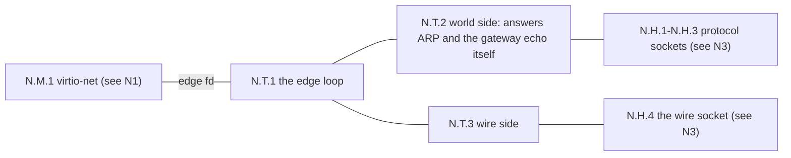
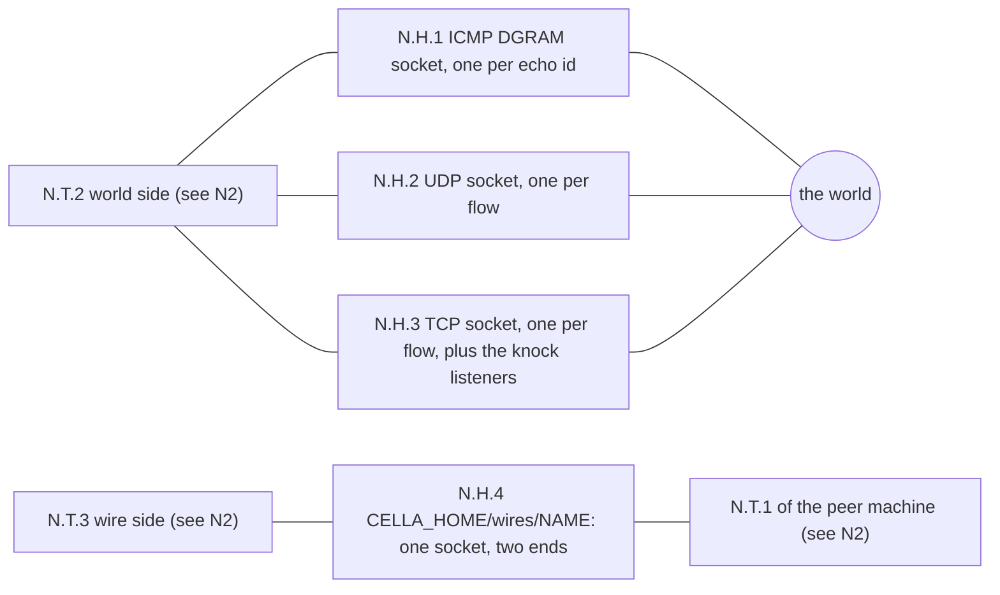
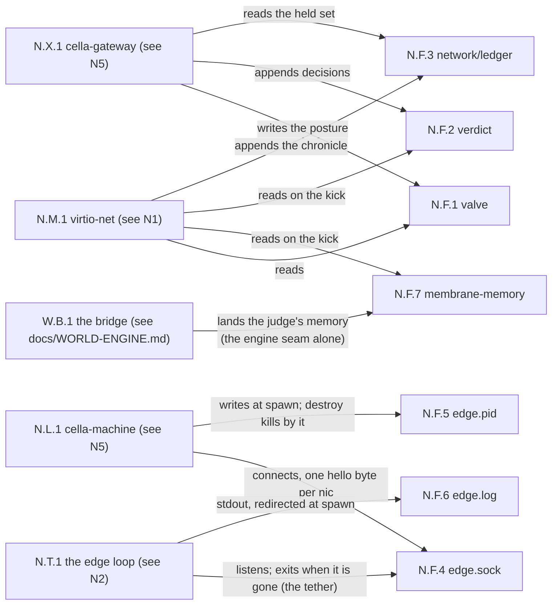
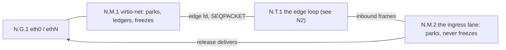
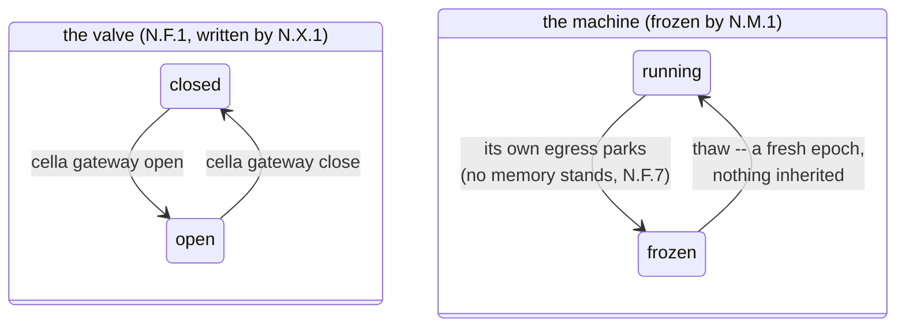
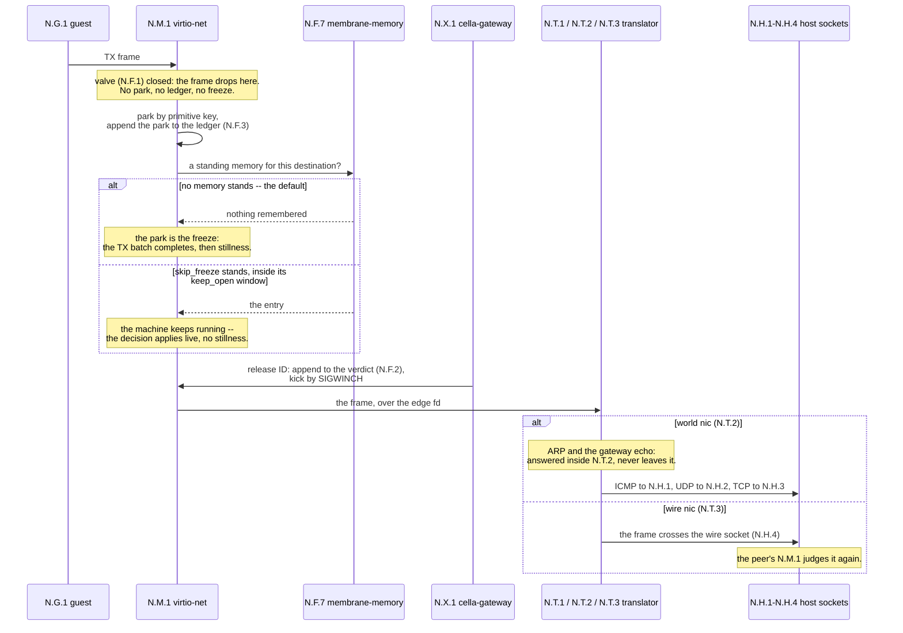
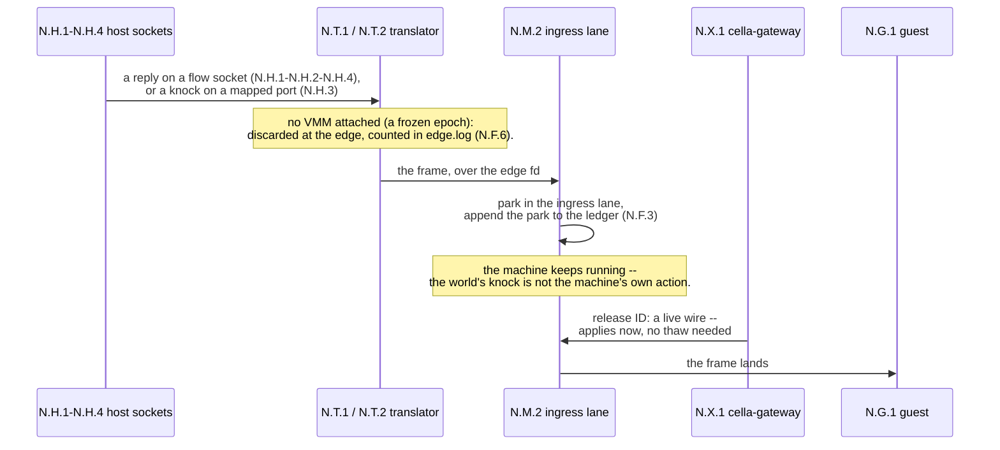
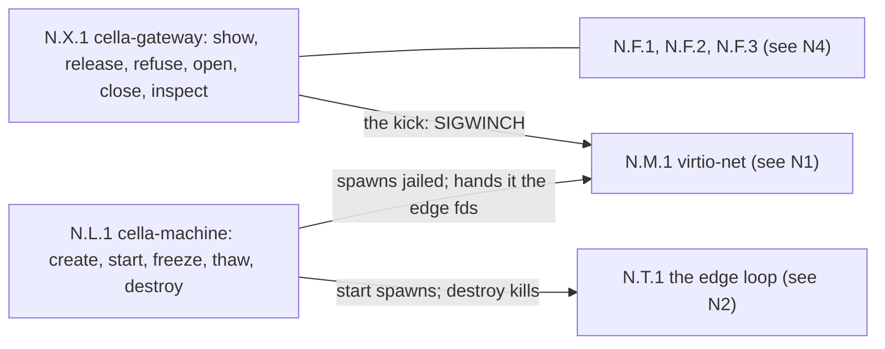

# The network model

The decision record for how a cella machine touches the world.
Accepted 2026-09-01. Revised 2026-09-03: the rootless network
(1.6.14e) is the shipped architecture, and the appliance phases
are descoped (ruled 2026-09-02). Revised 2026-09-15: roadmap
items 2-5 land as appliance-image and engine property -- the
terminator (see "The terminator") -- and the ruling stands: not
cella's core to build, and cella's core is untouched. The
mechanism's design record is docs/ROOTLESS-NETWORK.md; this
document states the law.

The diagrams share one identifier space, prefixed N: N.G is the
guest, N.M the membrane (the VMM), N.T the translator, N.H the
host kernel, N.F the files, N.X the control plane, N.L the
lifecycle plane. An identifier keeps its meaning in every diagram
here and in docs/ROOTLESS-NETWORK.md; a node owned by another
diagram appears as a pointer, named "(see Nx)". The topology
diagrams live in docs/ROOTLESS-NETWORK.md and docs/EXAMPLES.md.

## The decision

A machine is always shielded. The membrane is the machine's own
VMM, and no configuration bypasses it. `cella create <machine>` takes
one flag, `--net SPEC`, where SPEC is a comma list of nics:
`none` (the default, airgapped), `world[:PORT/proto+...]`, or
`wire:NAME`. A machine is born closed.

No host network object exists at any depth. The rule applies to a
cella inside a cella: each layer runs its own translators, and
each membrane judges its own frames.

## The shape

- **One translator per machine.** `cella start` spawns
  `cella-network edge <machine>`, one process, machine-lifetime:
  destroy kills it, and it survives freeze and thaw. It holds no
  capability. It exits on its own when its machine directory is
  removed.

- **The world side.** The translator answers ARP and the gateway's
  echo at the edge. It carries ICMP, UDP, and TCP through plain
  host sockets. DNS is UDP like any other; no resolver stands in
  the frame path (the terminator appliance may *be* a resolver --
  a guest at the far end of a wire, never the path itself).

- **The wire side.** A wire joins exactly two machines. Pairing is
  two manifests that name the same wire; the translators meet at
  `$CELLA_HOME/wires/<name>`. A wire imposes no address
  convention.

### N2 -- the translator

One process per machine, machine-lifetime, no capability.

### N3 -- the host kernel

Plain sockets, opened by the translator. Nothing else of cella's
exists in the host's network: no tap, no bridge, no rule.

- **The guest contract.** The guest sees a byte-identical network:
  the same virtio-net device, gateway 192.168.210.1, guest
  address 192.168.210.2 on a world nic. A guest image cannot tell
  the translator from a tap.

- **One directory.** `machines/<name>/` holds the network's whole
  state: the valve record, the verdict file, the membrane's
  memory, the ledger at `network/ledger`, and the translator's
  edge.sock, edge.pid, and edge.log. Branch, archive, and destroy
  carry it as one tree.

### N4 -- the files, their writers and readers

All under machines/NAME/. Each edge names the one writer or
reader; no file has two writers.

## The membrane

The chronicle is the machine's append-only record of what its
operations did -- parked, released, refused, when and to where --
written as history, never read back as truth. Field 15 chains each
entry to its predecessor by SHA-256; `cella doctor verify` proves
the book.

### N1 -- the frame path, machine side

The valve has two postures and no third: closed and open. Closed
is dark: no park, no ledger, no crossing, in either direction.
`cella gateway open` opens into the membrane, never into a free
flow. The posture is a file beside the machine; it survives stop,
freeze, thaw, and restart.

### The two automata

The valve's record is N.F.1; the machine's freeze is N.M.1's act.

The two automata are independent: a valve verb works against a
frozen machine, and the posture survives freeze, thaw, stop, and
restart. Closed drops at the membrane in both directions. Open
parks everything: egress freezes the machine, ingress never does.

Every egress frame parks by its most primitive name: (ethertype,
destination MAC), refined to (ip, port, proto) when IPv4 parses.
No frame is exempt -- ARP, IPv6, kernel chatter, any future
protocol. The frames of one flow group into one operation with one
UUIDv7 identifier, minted in the guest's frame.

The park is the freeze:

1. The VMM completes the TX batch in hand (the ring size bounds
   the holds).
2. It flushes the ledger.
3. It freezes before the guest runs again -- unless a standing
   memory names the destination with skip_freeze (N.F.7, below):
   then the machine keeps running and the decision applies live.
4. A release delivers the operation; a refusal lapses it
   cleanly, and the park order advances.

### The membrane's memory (N.F.7)

The judge can leave standing memory at the membrane: one entry per
destination, framed MembraneMemory messages in the membrane-memory file,
read on the kick. The write surface is the engine seam alone, and
no operator verb writes it -- memory is the judge's property, not
the CLI's: a memory rides the Decide stream (Accord version 4)
and lands through the bridge (W.B.1, docs/WORLD-ENGINE.md), which
stamps, appends, kicks, and witnesses. The judge is a gRPC rule
engine, whoever implements it; its policy source is its own
business, outside cella. A memory
affects freezing, never crossing: skip_freeze parks the matching
egress and keeps the machine running while the decision arrives --
for these crossings there is no gap, there is ordinary waiting, and
the guest sees the latency, deliberately. Every crossing still
parks, still gets its id and its decision, and still lands in the
chronicle: release and refuse stay the judge's alone. An entry
stands while now < written + keep_open -- the bridge stamps
written at the write, host clock, and expiry is absolute: any
membrane at any read computes it, nothing re-anchors at a thaw,
and an expired memory stays expired. The window burns in host
time, deliberately: the memory is the judge's property, and its
risk window is real-world time -- a freeze does not preserve it.
Fail-closed throughout: an abandoned memory cannot outlive its
window, eternal is not expressible, and an absent file, an absent
entry, or a zero field decode to the default: the park is the
freeze. The file is append-only, never compacted: every byte in
it is a ruling the judge chose to make, and the machine's death
deletes it with everything else.

### The egress walk -- the machine's own action

The identifiers are N1-N5's: the frame walks N.G.1 into N.M.1, and a
release walks it out through N.T.1.

Nothing is inherited, within an epoch or across one. No pass
table exists: a release delivers one operation, and the next frame
to the same destination parks again. A thaw starts a fresh epoch
and every staged judgment applies in park order. Twins park and
freeze identically; the ratchet is deterministic in the guest's
frame.

## The ingress lane

The world's knock is not the machine's own action. An inbound frame --
a flow's reply, or a connection on a mapped port -- parks in the
ingress lane, and the machine keeps running. The knock reaches a
machine only through the port map its manifest names
(`world:1709/tcp+1709/udp` maps host port 1709 to the guest).

Release is a live wire:

1. Against a running machine, the decision applies now, no thaw
   needed.
2. Against a frozen machine, it stages, and the thaw applies it
   in park order.
3. A frame that arrives while no VMM is attached is discarded at
   the edge and counted, never buffered across the gap.

### The ingress walk -- the world's knock

## The control plane

`cella gateway <machine> <verb>` is the surface, its own thin CLI. It
acts on files and signals alone: it writes the valve record, reads
the ledger, and kicks the running VMM. It holds no capability, and
neither does any other network binary.

- `show [incoming|outgoing]` -- the held operations, one line
  each: identifier, destination or source, age, state.
- `release <id>` / `refuse <id>` -- decide one operation by id
  prefix.
- `open` / `close` -- the valve.
- `inspect <id>` -- render a frozen hold's plaintext; the look is
  witnessed in the chronicle. Judgment requires sight, and sight
  requires stillness.

**One language.** `proto/cella.proto` defines the vocabulary:
Event (an operation parked, released, or lapsed), Operation (id,
destination, both clocks), Decision, Valve, and `service Engine {
rpc Decide(stream Event) returns (stream Decision) }`. The verbs
speak it today; an engine that arrives later speaks the same
schema, and nothing gets rewritten. gRPC never enters a VMM.

### N5 -- the control and lifecycle planes

Files and signals only. Neither binary holds a capability.

## The invariant

No cella process holds a capability, and no host network object of
cella's exists -- no tap, no bridge, no NAT rule, no daemon. Every
frame in both directions parks and is decided at the membrane.
Every machine is born closed. No allow outlives its decision --
a release moves one operation and installs nothing -- and no
interface carries an unmanaged mode.

## The accepted costs

- Every crossing is judged: the datapath costs a decision per
  operation, and multi-cycle exchanges ride the peer's patience.
- One translator process per machine, for the machine's life.
- A forwarding topology (a gateway guest between wires) costs a
  judged crossing at every membrane it traverses, deliberately.

## The terminator

The one network appliance (ruled 2026-09-15): an ordinary cella
machine wearing the `terminator` rootfs flavor, in the pair seat
-- a member on a wire, the world on the other nic -- that splits
every TCP connection in two and owns the names. This section is
the law; the mechanism and the eight gates' walks are
docs/TLS-TERMINATOR.md, and the builder's contract is
docs/integration/TLS-TERMINATOR.md.

- **Two legs.** The member's peer is always its terminator: that
  leg's patience is ours, and a member may freeze mid-handshake
  for as long as judgment takes. The world leg is the
  terminator's own connection, made at wire speed; the world peer
  never meets a freeze the terminator itself does not take.
- **Terminate and splice, every TCP port.** The proxy peeks the
  member leg's first bytes: a TLS ClientHello is terminated --
  the SNI names the world peer, a leaf is minted from the pair
  CA, and the world leg is TLS of the terminator's own -- and
  anything else is a plain byte splice, which alone moves
  peer-patience off the member for every TCP protocol.
- **The pair CA, consented.** The CA key is baked into the
  terminator image at build and never leaves it; the CA cert
  exports beside the golden, and a member trusts it because its
  builder baked it into the trust store. The middle is the
  architecture, chosen at image build, on the record
  (docs/integration/TLS-TERMINATOR.md states it loudly).
- **The names live at the appliance -- and the resolver is the
  interceptor.** Members point resolv.conf at the terminator's
  wire address, and the resolver answers every query with that
  same address: the member connects to the terminator believing
  it is the world, and the real name rides in the connection
  itself -- the SNI for TLS on any port, the Host header for
  plain HTTP. The proxy resolves the real address at connect
  time, upstream over the world nic as ordinary judged UDP to a
  configured provider, cached at the appliance. No netfilter, no
  redirect, no proxy variables in members: the canonical kernel
  stays quiet, and interception is an answer, not a rule. A flow
  that carries no name (a bare TCP port that is neither TLS nor
  HTTP) is served only by a static per-port map in the
  terminator's configuration -- a matcher that never guesses
  cannot route a nameless flow. Roadmap item 5 lands here, in a
  guest.
- **Just another machine.** No lifecycle exception exists: the
  terminator parks, freezes, and thaws like any machine, and the
  judge's standing memory (N.F.7) keeps its hot paths -- 443 and
  the DNS provider -- deciding live. The honest consequence: a
  world-leg session does not survive a terminator freeze
  mid-flight. Memory makes such freezes rare on remembered
  paths; what slips through is an upstream retry, never a broken
  promise.
- **In-image machinery, not cella's.** The proxy and the resolver
  are guest userland (the cella-terminator crate: a new category
  -- no witness door, no install, no shim row; it ships only
  inside the image, like busybox). The proto gains nothing:
  frames are frames, and the engine's vocabulary suffices.

## Roadmap

Cella ends as the enforcement primitive: every crossing named,
held, decided by someone else, witnessed. The items below build on
that primitive, in order, at the proto seam -- each one belongs to
the world engine, not to cella.

1. The engine: `service Engine` receives the Event stream and
   answers with Decisions -- the judge becomes a program.
2. The appliance pair: a gateway machine between a member and the
   world, judging as a resident. (Landed 2026-09-15 as the
   terminator -- see "The terminator"; no resident exemption,
   just a machine.)
3. TCP termination at the appliance: the member's peer is always
   its appliance, and world-side flows survive any freeze length.
   (Landed with the terminator, as terminate-and-splice.)
4. TLS against a pair CA: the appliance terminates, the member
   trusts its own CA from birth. (Landed with the terminator.)
5. DNS as a service: resolution becomes a parkable operation on a
   name. (Landed at the appliance: the terminator resolves and
   caches; the upstream is judged, remembered UDP.)
6. Ownership of peer patience: the engine manages what the
   world's timeouts will bear.
7. The timeline rewrite: application-layer timestamps translated
   into the machine's frame at the one boundary.
