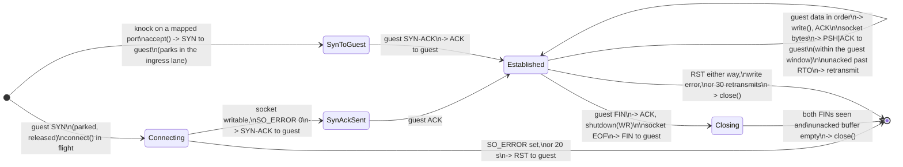
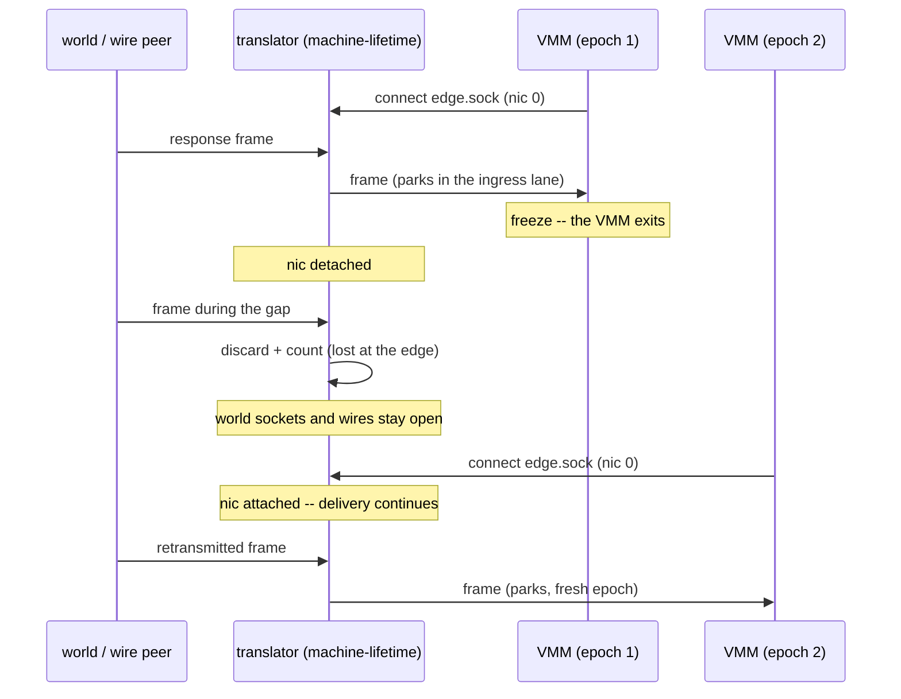

# The rootless network

This document is the design record for task 1.6.14e. The design
removes all network privilege: no capability, no privileged
process, no network state on the host. The network becomes
processes and file descriptors, and the invoking user owns all of
them. The Operator ruled the design on 2026-09-02. Five sections
below carry the mark "Ruling". The build lands in rungs. Each
rung names its gate. The pool-tap network operates in parallel
until the last rung removes it.

## The shape

Each machine has one network peer: its own translator. The
translator is one cella-network process per machine. Each nic in
the VMM is a file descriptor to that translator. The VMM does not
hold a tap, a socket, or a wire. The translator holds the
machine's edges: wires to the translators of other machines, and
the world side. On the world side, the translator converts
released frames into unprivileged socket calls. The membrane --
park, decide, release -- stays in the VMM and does not change.
This document describes the far side of the decided door. It does
not change the door.

## Before and after

Before: the network is host state. Root builds it one time
(setcap, taps, bridge, NAT, forwarding, firewall rules). The
kernel routes it. A reboot damages it:

```
                      THE HOST (root built this)
  ┌──────────────────────────────────────────────────────────────┐
  │  nftables NAT ── ip_forward ── firewalld zone ── DOCKER-USER │
  │        │                                                     │
  │     enp1s0                 brp0 (bridge)                     │
  │        │                   /        \                        │
  │      tap0     tap1     pair0a     pair0g   ... (the pool)    │
  └───────┼────────┼──────────┼──────────┼──────────────────────-┘
          │        │          │          │   tap fds, owner-gated
      ┌───┴───┐┌───┴───────---┴──┐   ┌───┴───┐
      │ VMM m1││ VMM gw (2 nics) │   │ VMM ag│      (guests)
      └───────┘└─────────────────┘   └───────┘
```

After: the network is user processes and file descriptors.
Nothing exists before its machine exists. Nothing survives its
machine. Root builds none of it:

```
        THE WORLD                          THE WORLD
            ▲                                  ▲
            │ plain sockets                    │ plain sockets
            │ (sendto/connect,                 │
            │  no capability)                  │
  ┌─────────┴─────────┐   wire "p0"  ┌─────────┴─────────┐
  │ cella-network(gw) │◄────────────►│ cella-network(ag) │
  │  the translator   │ unix conn at │  the translator   │
  │  machine-lifetime │ wires/p0     │                   │
  └─────────┬─────────┘              └─────────┬─────────┘
            │ edge.sock: one conn per nic,     │
            │ fd to the VMM (--edge-fd)        │
      ┌─────┴─────┐                      ┌─────┴─────┐
      │  VMM gw   │                      │  VMM ag   │
      │ (membrane:│                      │ (membrane:│
      │  park,    │                      │  decide,  │
      │  decide)  │                      │  release) │
      └───────────┘                      └───────────┘
   The VMM exits at a freeze. The translator continues, and holds
   the world sockets and the wire.
```

The membrane is in the same position in both pictures: in the
VMM, at the one door. The change is above the membrane: host
state becomes per-machine processes, and the number of root
operations becomes zero.

## The translator (Ruling: one per machine, machine-lifetime)

cella-network is the translator. One process serves one machine.
The first start of the machine spawns it. It stays alive across
each freeze and each thaw. It dies at destroy. Its lifetime is
the lifetime of the machine, not of one VMM run. The reason is
state: the translator holds the world-side sockets, and a freeze
must not destroy them. A TCP connection to the world survives a
frozen machine because the translator holds the connection while
the VMM sleeps. The judge manages the patience of the world's
peers; the translator is the process that makes this possible.

The translator has no intelligence, by design. It is not a
resolver, not a cache, and not a policy point. It does not see
frames before a decision: frames come to it only through the
VMM's one door, after a release. A compromised translator can
change the traffic of one machine and nothing more. It holds no
capability and no file descriptor of an other machine. At the
last rung it gets the smallest jail in the system: no /dev/kvm,
no machine data, only its own file descriptors and sockets.

### The translator's TCP

The world side of the translator keeps one TCP flow per (guest
port, peer address, peer port). The flow is a small state machine
between a guest segment stream and one host socket. The guest's
own stack retransmits in its direction. The translator
retransmits in the other direction from an unacknowledged buffer
on a timer, because a frozen machine loses frames at the edge and
the translator carries that patience, not the world's peer. Every
segment the translator emits carries a pseudo-header checksum.



Two facts hold in every state. First, a segment that reaches
this machine only reaches the guest after it parks in the
ingress lane and a judge releases it; the state machine sees the
guest's answer only after the answer parks and is released on
the way out. Second, the translator holds the socket across a
freeze: the flow's world side does not close because the guest
sleeps, and the retransmit timer feeds the new epoch until the
guest acknowledges again.


## The edge (the VMM side)

A nic's backend in the VMM is an Edge: a file descriptor that
carries full frames. Each frame starts with the 12-byte
virtio_net_hdr. Each read and each write moves one frame. The fd
carries O_ASYNC, and SIGIO interrupts KVM_RUN when a frame
arrives. A host tap satisfies this contract. A unix
SOCK_SEQPACKET connection to the translator satisfies the same
contract. net.rs uses the contract and does not know the kind of
edge below it.

The edge is a connection, not an inherited socketpair, because of
reattachment. A freeze exits the VMM. The thaw starts a new VMM.
The translator continues across the gap. The translator therefore
listens on one named socket in the machine directory
(`<machine-dir>/edge.sock`). Each VMM run connects at spawn: one
connection per nic, with a one-byte hello that names the nic
index. The spawn passes the connected fd to the VMM as
`--edge-fd N`. A socketpair from the spawn dies with the VMM that
holds it. A connection to a listener has no such problem, because
the listener continues.

## Frames lost at the edge (the drain; the translator owns it)

The law says: frames that arrive while a machine is frozen are
lost at the edge, and the protocols above send them again. A tap
gave this without code: the kernel drops a frame that has no
reader. A translator must give it deliberately. While a nic has
no VMM connection, the translator discards each frame that
arrives for that nic, and counts it. It does not buffer across
the gap. The new epoch starts with an empty wire. The first
retransmitted frame parks like any frame.

The VMM does not drain, and does not estimate what is stale. A
stale frame is a frame that arrived while no VMM was attached.
Only the process that saw the attachment gap can know this. (A
drain at the VMM's thaw edge was built and then removed: it ran
after the edge opened, and it destroyed new-epoch mail. The
battery found this.)

## Wires (Ruling: translator-to-translator; the manifest pairs)

A wire connects two machines. Two manifests that name the same
wire create it: `--net wire:p0` on both sides. There is no pair
verb, no bridge, and no host object. The spawn and the
translators do all of it:

- Rendezvous: `$CELLA_HOME/wires/<name>` is a unix listener. The
  machine with the smaller name (in byte order) listens. The
  machine with the larger name connects, and tries again until
  the peer is up. The roles are deterministic. There is no race.
- Forwarding: a frame from the VMM's nic goes to the peer
  translator of that wire. A frame from the wire goes to the
  VMM. The pump does not parse. Each frame was decided before a
  translator saw it, on both sides: a wire connects two
  membranes, and each end judges its own traffic.
- A frozen peer is not an error. The peer's translator discards
  the frame under the drain rule above, or the peer's VMM parks
  it in the ingress lane. Both translators live longer than both
  VMMs. The wire does not break because a machine sleeps.

A topology with more than two members (a switch with N wire
ports) is not a goal of this task. A switch is an appliance
machine, resident in the world and judged like each machine. It
waits as its own task.

## The world side (Ruling: L4 translation; DNS is only UDP)

The world nic (`--net world`) is the other half of the
translator: a layer-4 translation in the shape of pasta, written
in this repository, not vendored. A released egress frame becomes
a sendto or connect call on an ordinary socket. A response
becomes a frame. The frame crosses to the VMM and parks in the
ingress lane, and it waits for its own release, like each frame
from each wire. ARP stops at the translator: the translator
answers with the deterministic gateway MAC that the guests
already use. ICMP echo, UDP, and TCP translate. TCP is the
stateful half: a socket table per flow, SYN to connect, sequence
bridging, FIN and RST.

There is no DNS path. A DNS query is a UDP frame to port 53. It
parks in the VMM, it freezes the machine, and it waits for the
judge, like each other crossing. Only a released frame comes to
the translator, and the translator only transports it. Nothing
resolves for the resident. Nothing crosses because of its class.
Nothing stands.

## The knock (Ruling: a port map in the manifest)

The world reaches a machine only where the manifest says it may:
`--net world:1709/tcp,1709/udp` maps host ports to the guest,
and the translator listens on them as the invoking user. An
arrival becomes a frame on the edge and parks in the ingress
lane, like any knock: the machine does not freeze, the guest
sees nothing before a release, refuse drops the knock unseen, a
closed valve drops it before the park, and the guest's answer
parks on its way out. The port map grants nothing. It names the
knockable surface, in the manifest, witnessed like every other
declaration.

## The guest contract (Ruling: byte-identical)

From the inside of a machine, nothing changes: the same subnets,
the same gateway addresses, and the same MAC conventions, now
answered by the translator instead of the host stack. No golden
image changes. No guest configuration changes. The gates are the
proof: smoke-gateway certifies the wire plane, and the ear gates
certify the world plane, both without modification.

## Freeze and thaw, end to end



- Freeze: the VMM exits. Its edge connections drop. The
  translator marks each nic as detached, discards arrivals, and
  counts them. World sockets stay open. Wires stay connected.
- Thaw: the new VMM connects, one connection per nic. The
  translator marks the nic as attached, and delivery continues.
  Decisions that arrived during the freeze apply at the thaw
  edge, as before. This design does not touch the valve automaton
  or the ledger.
- Destroy: the machine directory goes away. The translator dies.
  Its listener and its wire ends close. The peer translator sees
  a dead wire and counts discards until its own destroy.

## What this removes

The pool, `setup`, `pair`, `own`, the taps, /dev/net/tun in the
VMM's jail and in its pre-filter phase, the tap-claim code, the
neighbor pins, nftables NAT, ip_forward, the firewalld and
DOCKER-USER interactions, the boot unit and its linger
workaround, and the setcap root moment. After the last rung,
getcap finds nothing, no privileged process exists, and the only
sudo in the story is the package block of `make install`. The
network is files and processes that the user owns. They appear on
demand. They are gone at destroy. No state remains for a reboot
to damage.

## The rungs

1. The edge seam: `Edge::tap` and `Edge::from_fd`, `--edge-fd`,
   and the one-door gate follows the door. Gate: the full battery
   on taps, with no change in behavior.
2. The wire plane: the translator (wires only), edge.sock
   reattachment, `--net wire:NAME`, and the drain rule. Gate: the
   pair rungs of smoke-gateway over wires, plus a focused wire
   gate that asserts the frozen-peer discard count.
3. The world side, stateless half: ARP, ICMP echo, UDP. Gate:
   smoke-ping and smoke-udp over `--net world`, without
   modification.
4. The world side, stateful half: TCP. Gate: AC5 -- the real
   internet fetch through freeze cycles.
5. The removal: each item in the list above is deleted; the
   translator gets its final jail and seccomp list; install and
   doctor are rewritten. The rung also cleans both hosts -- the
   VM host and the bare-metal host -- of what the pool left: the
   taps, the pair taps, the bridges, the nft table, the firewalld
   and DOCKER-USER rules, the boot unit and its linger, and every
   make target or script that assumed a tap. Gate: the full
   battery green with no tap on the host, a getcap sweep that
   finds nothing, and a sweep that finds no tap, bridge, or nft
   table of cella's after make install.
6. Both machines: `make install` and the full battery on the
   second host.
