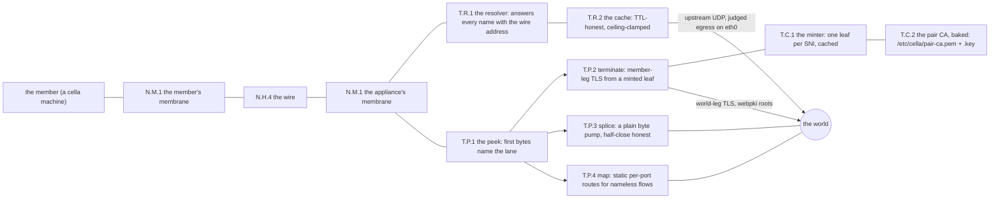
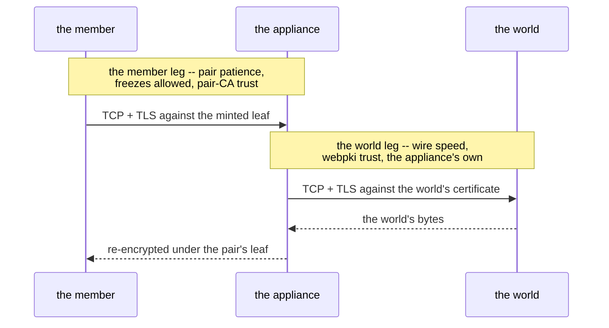
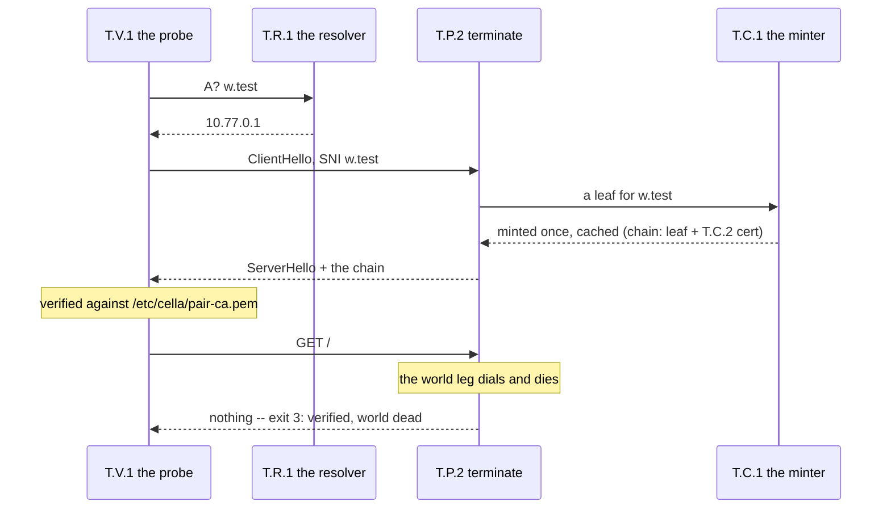
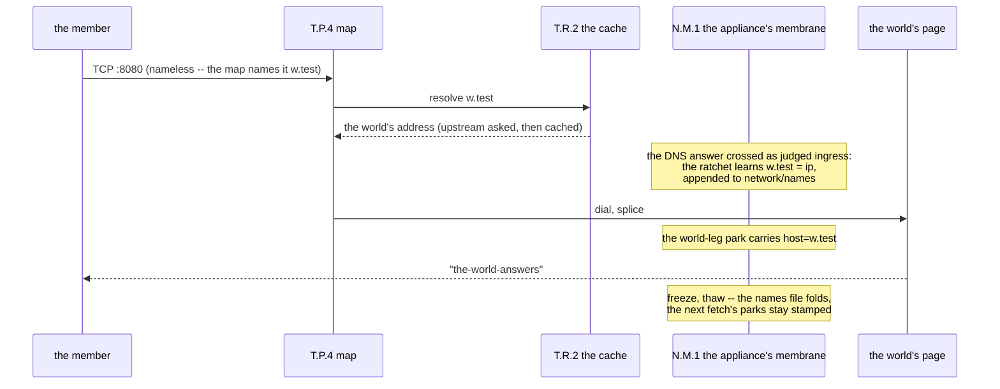
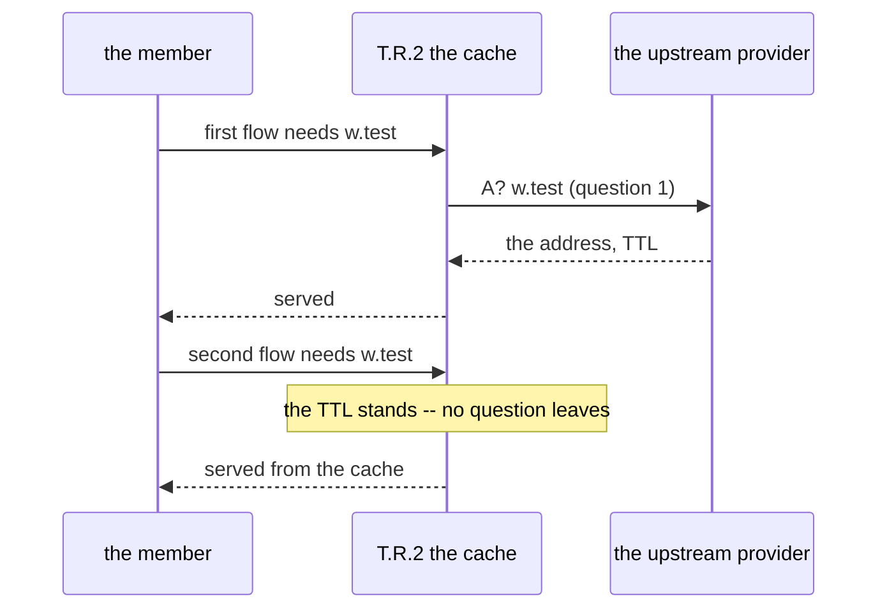
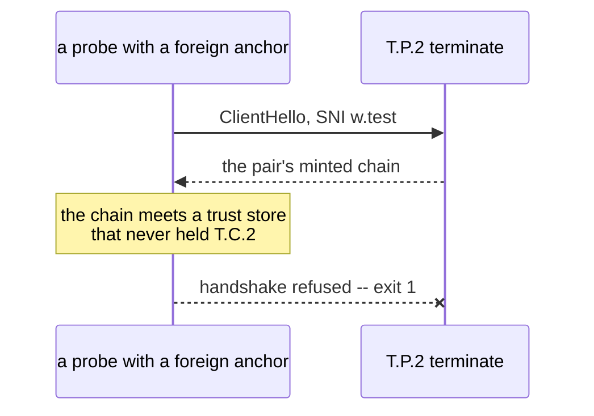
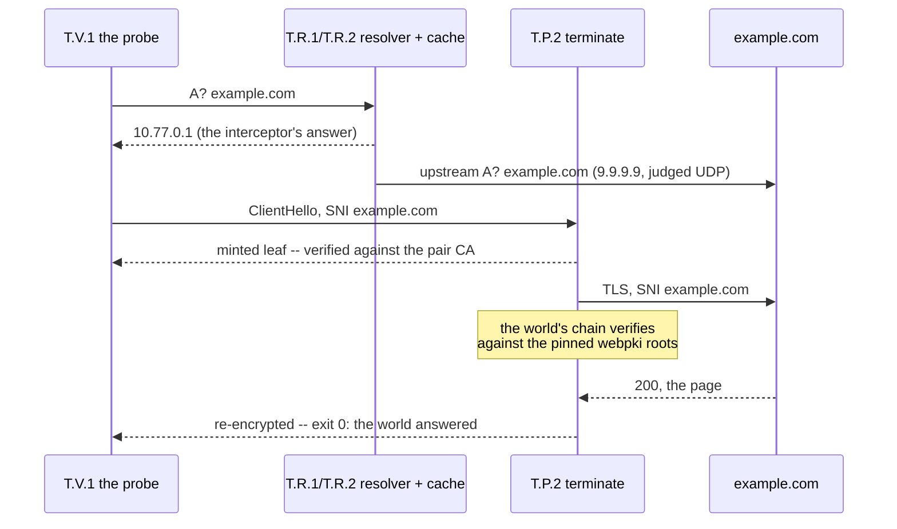
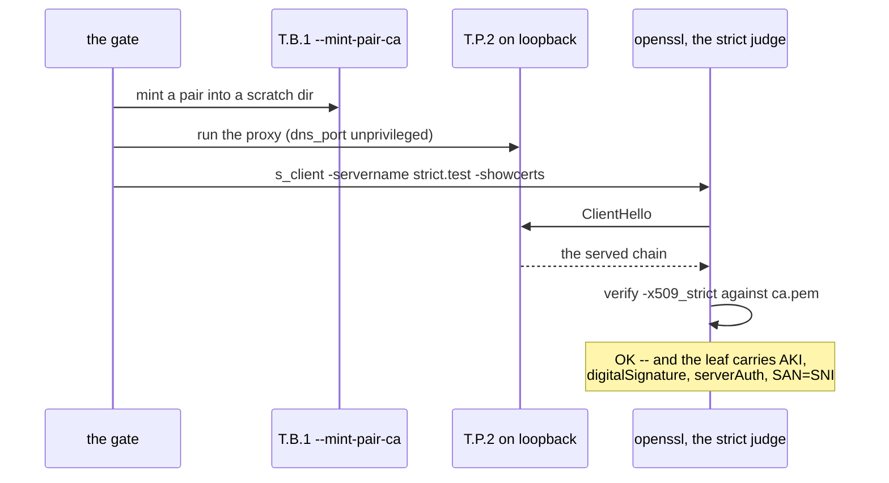
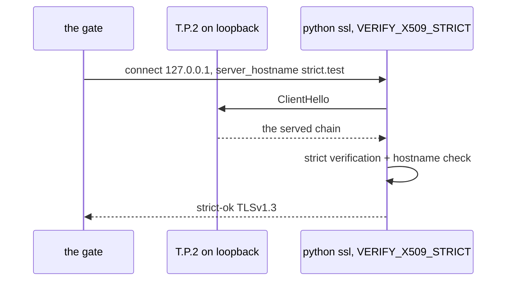

# The terminator

The design record for the one network appliance: the machine that
terminates TLS at the pair border, resolves and caches names for
its members, and splices what it does not terminate. The law is
docs/NETWORK-MODEL.md ("The terminator"); the integrator's
contract is docs/integration/TLS-TERMINATOR.md; the board entry
is tasks/PHASE2-security.md, 2.7. This document states the
mechanism and shows each gate's walk.

Status: shipped (2026-09-15). The proxy (crates/cella-terminator),
the image (`cella build rootfs terminator`), and the pair CA
export are built. Eight gates run green (`make
smoke-tls-terminator`, TESTING.md rosters them).

The identifiers: T.R is the resolver, T.C the pair CA, T.P the
proxy lanes, T.V the probe voice, T.B the build door -- minted
here (T for this document, per the first-letter rule). All other
identifiers are borrowed: N.* from docs/NETWORK-MODEL.md, W.*
from docs/WORLD-ENGINE.md.

## T1 -- the appliance, in one map

An ordinary cella machine in the pair seat: eth1 faces the member
on a wire, eth0 faces the world. Both nics stand behind the
machine's own membrane (N.M.1) -- no exemption exists, and the
judge's standing memory (N.F.7) is what keeps the hot paths live.



The lanes are exclusive and the peek never guesses: a TLS
ClientHello terminates (T.P.2), an HTTP head replays into a
splice by its Host header (T.P.3), a configured port maps
(T.P.4), and a nameless bare-TCP flow on an unmapped port is an
error, never a route.

## The two legs

The member's peer is always its terminator, so the member leg's
patience is the pair's own: a member may freeze mid-handshake for
as long as judgment takes. The world leg is the terminator's own
connection at wire speed. Every frame of both legs still parks at
the appliance's membrane; the standing grants
(docs/integration/MEMBRANE-MEMORY.md) are what make the parks
live instead of frozen.



## The gates, one walk each

The eight criteria live in scripts/test/tls-terminator.sh (t1-t6,
a live pair on KVM) and scripts/test/tls-terminator-strict.sh
plus scripts/test/tls-terminator-python-strict.sh (t7-t8, the
minter's bytes on a loopback wire, no VMs). TESTING.md rosters
the family; `make smoke-tls-terminator` runs it.

### t1 -- the resolver is the interceptor

Every query gets the same answer: the appliance's own wire
address. Interception is an answer, not a rule; the kernel stays
quiet.

```mermaid
sequenceDiagram
    participant M as the member
    participant R as T.R.1 the resolver
    M->>R: A? w.test (resolv.conf points at the wire)
    R-->>M: A w.test = 10.77.0.1 (itself, TTL 30)
    Note over M: every name leads to the appliance;<br/>the real name rides in the flow itself
```

### t2 -- termination verified against the baked pair CA

The member's probe (T.V.1) dials the answer, offers the SNI, and
verifies the minted leaf against the pair CA it baked at build.
The world is dead by design: exit 3 says "verified, world dead"
-- the local proof that interception, minting, and SNI all hold.



### t3 -- the nameless splice, and the durable ratchet

A configured map (T.P.4) routes a nameless port through a
resolved name to the world. The gate also proves two membrane
facts on the way: the world-leg park carries the resolved name
(the name ratchet, proto/cella.proto `Destination.host`), and the
name survives a freeze -- the names file (`network/names`) folds
at the thaw, so post-thaw parks of the same flow stay stamped.



### t4 -- TTL-honest caching

The cache answers what it holds while the TTL stands. The second
flow asks the upstream nothing; the gate counts the upstream's
questions and requires zero growth.



### t5 -- the unauthorized middle is refused

A probe trusting a different anchor must refuse the handshake:
no pair trust, no middle. This is the member's protection stated
as a gate -- the middle works only for members that consented at
image build.



### t6 -- the named world (https://example.com)

The whole seam against the real internet: real DNS upstream, a
real world certificate verified against the pinned webpki roots,
and the pair's minted leaf on the member leg. The gate SKIPs
without internet. The world-leg destination is unknowable at
policy time, so the judge's remember rule plants each released
443 park's own memory (the motor's `--remember "*:443:600"`).



### t7 -- the strict verifier (openssl)

rustls tolerates a bare leaf; a member's stricter stack is
entitled not to (RFC 5280). The gate stands the proxy on
loopback as an ordinary user, fetches the served chain with
`openssl s_client`, and holds it to `openssl verify
-x509_strict` plus the extensions by name. No VMs: the subject
is the minter's bytes on a real wire.



### t8 -- the field verifier (python, VERIFY_X509_STRICT)

The stack that tripped in the field: Python's ssl module under
VERIFY_X509_STRICT (default-on since 3.13) raised
"missing Authority Key Identifier" against a bare leaf while
curl forgave it. The gate replays that exact stack, hostname
verification included.



## The minted leaf, exactly

The member's verifier is not the pair's to choose, so the leaf
serves the strictest honest one (t7 and t8 hold it there):

| Field | Value | Why |
|---|---|---|
| Subject / SAN | the SNI, verbatim | hostname verification's anchor |
| Validity | 1975-01-01 to 2200-01-01 | the frozen-member corollary (2.7 (c)): a member validates against its own past clock |
| AKI | the pair CA's SKI | RFC 5280 chain building under strict semantics |
| KeyUsage | digitalSignature only | exactly what a TLS server leaf is for |
| EKU | serverAuth only | nothing implicit, nothing more |
| Issuer | T.C.2, the baked pair CA | one pair, one CA, one blast radius |

The CA itself is a constrained root: CA:TRUE with pathlen 0,
KeyCertSign + CrlSign, its own SKI, self-signed (a root's missing
AKI is exempt under strict). Rebuilding the image mints a new
pair: the old members' trust dies with the old CA, deliberately
(docs/integration/TLS-TERMINATOR.md, "one pair, one CA").

## What the terminator is not

- **Not a router.** No forwarding exists; the resolver's answer
  is the only redirection, and a nameless flow without a map is
  an error.
- **Not exempt.** Every frame of both legs parks at the
  appliance's membrane; a terminator freeze kills a mid-flight
  world session honestly, and what slips through is an upstream
  retry (the honest freeze, stated in
  docs/integration/TLS-TERMINATOR.md).
- **Not a time machine, yet.** Timestamps pass through untouched;
  the timeline rewrite is board item 2.8, held.
- **Not host surface.** The crate is guest userland only (2.7
  (g)): no witness door, no install, no shim row. A fully
  compromised proxy still stands inside a jailed, judged cella
  machine.
