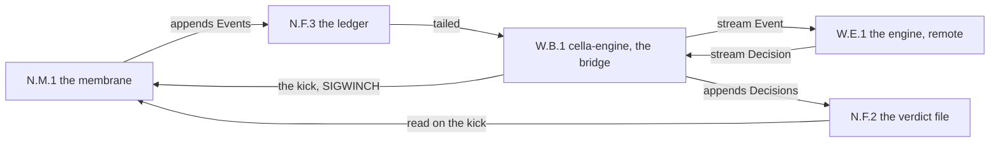
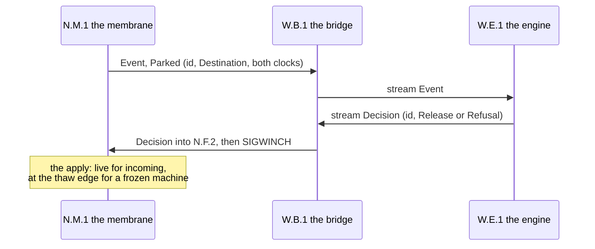

# The world engine

The design record for the programmatic judge: the engine that
decides a machine's border crossings through the gRPC seam. The law of
the border is docs/NETWORK-MODEL.md; the vocabulary is
proto/cella.proto; this document states how a program speaks it.

Status: the vocabulary and the file wire are shipped and
load-bearing. The stream (the bridge, W.B.1) is designed here and
is not built yet (tasks/PHASE2-security.md tracks the protocol
work as 2.6). Until it lands, a harness judges through the CLI
verbs, exactly as the gate scripts do.

The identifiers: W.B is the bridge and W.E the engine, minted
here (W for this document, per the first-letter rule). All other identifiers are borrowed: N.* from
docs/NETWORK-MODEL.md, L.* from docs/LIFECYCLE.md.

## The seam, in one map



Three layers, one vocabulary:

1. **The vocabulary.** proto/cella.proto defines Message, Event,
   Operation, Decision, Valve, and `service Engine`. prost
   compiles it into cella-libs; every party speaks these types.
2. **The file wire, shipped.** The ledger (N.F.3) holds framed
   Events; the verdict file (N.F.2) holds framed Decisions. The
   files are the resting form of the stream.
3. **The stream, designed.** The bridge (W.B.1) tails the ledger,
   calls `Decide`, and lands each returned Decision in the
   verdict file with a kick. The membrane never learns which
   judge wrote the file.

## The Decide walk



The rules of the walk:

1. The engine decides by id, never by class: one Decision names
   one Operation.
2. A release delivers one operation, once. No allow outlives its
   decision (Accord version 2 retired allow_flow).
3. Freezing is absent from the stream on purpose: the freeze is a
   machine verb (N.L.1), and the membrane only keeps holding.
4. The engine and the operator can judge together: both write
   the same verdict file, and both books witness both hands.

## The operations, via CLI and via engine

Each row is one act of judgment. The CLI form works today; the
engine form works when the bridge lands. The two forms write the
same bytes.

### Observe the holds

Via CLI:

```sh
cella gateway <vm> show            # both directions
cella gateway <vm> show incoming   # the ingress lane (N.M.2)
```

Via engine: no request exists or is needed. Every park arrives as
an Event on the Decide stream, with the id, the Destination, the
direction, and both clocks.

### Release one operation

Via CLI:

```sh
cella gateway <vm> release <id-prefix>
```

Via engine: send one Decision on the stream:

```
Decision { id: <the operation id>, release: Release {} }
```

### Refuse one operation

Via CLI:

```sh
cella gateway <vm> refuse <id-prefix> --why "off the allowlist"
```

Via engine:

```
Decision { id: <the operation id>, refusal: Refusal { why: "off the allowlist" } }
```

### Open and close the valve

Via CLI:

```sh
cella gateway <vm> open
cella gateway <vm> close
```

Via engine: not on the Decide stream. The valve is the border's
posture (N.F.1), not a judgment on an operation. The envelope
carries a Valve message for a future control wire; today the
posture changes through the CLI alone.

### Inspect a frozen hold

Via CLI:

```sh
cella gateway <vm> inspect <id-prefix>
```

Via engine: not on the Decide stream. Sight requires stillness
and a witnessed look; the render stays an operator act. The
Inspected event appears on the stream as evidence that a look
happened.

## An engine, minimal

An engine is a gRPC server that implements `service Engine`. The
bridge dials it and opens one Decide stream per machine. A
minimal allowlist engine in Python:

```python
import grpc, cella_pb2, cella_pb2_grpc
from concurrent import futures

ALLOW = {(b"\x01\x01\x01\x01", 443)}   # (ip, port)

class Engine(cella_pb2_grpc.EngineServicer):
    def Decide(self, events, ctx):
        for ev in events:
            if not ev.HasField("parked"):
                continue                     # completions are evidence
            op = ev.parked
            key = (op.destination.ip, op.destination.port)
            d = cella_pb2.Decision(id=op.id)
            if key in ALLOW:
                d.release.SetInParent()
            else:
                d.refusal.why = "off the allowlist"
            yield d

s = grpc.server(futures.ThreadPoolExecutor(max_workers=4))
cella_pb2_grpc.add_EngineServicer_to_server(Engine(), s)
s.add_insecure_port("127.0.0.1:1709")
s.start(); s.wait_for_termination()
```

Generate the stubs from the one vocabulary:

```sh
python -m grpc_tools.protoc -Iproto \
    --python_out=. --grpc_python_out=. proto/cella.proto
```

The walk of one run against it:

1. Start the engine (above).
2. Start the bridge: `cella-engine <vm> --dial 127.0.0.1:1709`
   (the planned invocation; the bridge is spawned by the harness,
   the way N.T.1 is spawned by start -- never by the shim).
3. Create, start, and open the machine through the CLI.
4. Every park streams to the engine; every Decision lands in the
   verdict file and applies.
5. Stop the engine, and the machine holds: an undecided operation
   waits, and stillness is the failure mode
   (docs/NETWORK-MODEL.md, the membrane's law).

## The gates

The bridge lands with five acceptance rungs, one gate each, in
dependency order; `make smoke-engine` runs all five. Each rung's
teardown asserts that the bridge died with the run.

1. **engine-w1 -- the stream stands.** The bridge dials a toy
   engine, the Accord agrees, and a park arrives as an Event with
   its id, its Destination, its direction, and both clocks.
   Observation only: no decision is sent.
2. **engine-w2 -- the decision lands.** The engine releases an
   allowed destination and refuses another. The release delivers
   and completes; the refusal lapses with its why; both land in
   the book (N.F.3).
3. **engine-w3 -- stillness on engine death (negative).** The
   engine dies mid-hold. The operation waits, nothing defaults in
   either direction, and a restarted engine resumes judging the
   same hold. This rung is the reason the bridge never decides.
4. **engine-w4 -- the frozen machine.** Decisions against a
   frozen machine stage in the verdict file (N.F.2), and the thaw
   applies them in park order. A kick against a machine with no
   pid stages; it does not error.
5. **engine-w5 -- two judges.** An operator release (N.X.1)
   interleaves with the stream. Both hands land, both books
   witness both, and no decision applies twice.

The no-KVM tier gains test-seccomp-engine, and the witness-door
count includes the new binary when it lands.

## Audit

The two hands of judgment leave symmetric records, by
construction:

1. **The chronicle is judge-blind.** Every decision's effect
   lands in the ledger (N.F.3) as a Released or Lapsed event,
   chained (field 15), identical whichever hand decided. The
   operations book cannot tell the engine from the operator.
2. **The verb book names the hand.** An operator's release lands
   in the machine's audit book as an N.X.1 entry (verb, uid, gid,
   persona, host clock, chained). The bridge writes the same
   shape: one audit entry per landed Decision, persona
   cella-engine, plus one entry for its own spawn. A reader of
   the book sees who judged, entry by entry.
3. **The stream itself is not a record.** gRPC bytes are
   transport; nothing replays them. The books are the evidence,
   and the gate engine-w5 asserts the symmetry: two judges, both
   witnessed, no decision applied twice.

## What the bridge never does

1. It never decides. An engine that is down means holds that
   wait, not defaults in either direction.
2. It never opens the valve, thaws, or frees a machine: those are
   N.X.1 and N.L.1 verbs, on the record.
3. It never enters a VMM. gRPC ends at the bridge; the membrane
   reads files and signals alone.
